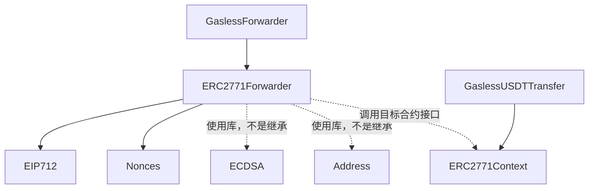
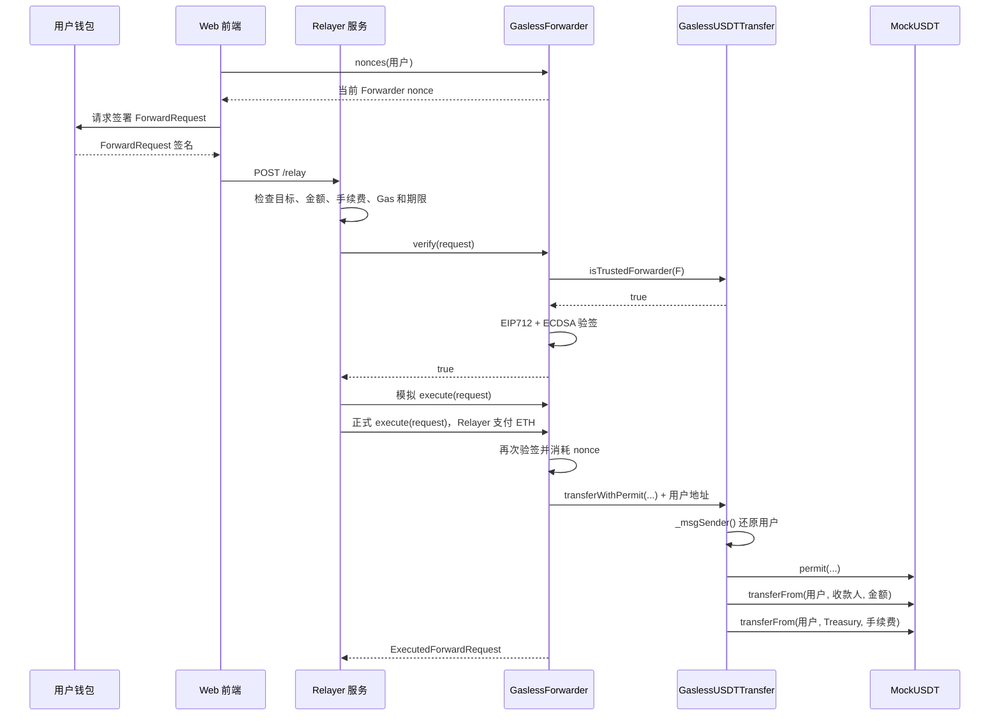

# GaslessForwarder 合约完整逻辑与继承关系

`GaslessForwarder` 是整个无 Gas 系统里的“可信代提交合约”：

- 用户只签名，不发送链上交易。
- Relayer 拿到签名后，调用 `GaslessForwarder.execute()` 并支付 Sepolia ETH。
- Forwarder 验证签名、Nonce、有效期和目标合约。
- 验证成功后，Forwarder 代表用户调用 `GaslessUSDTTransfer`。
- 它把用户地址追加到 calldata 末尾，使目标合约能够通过 ERC-2771 找回真实用户。

源码：[`contracts/GaslessForwarder.sol`](../contracts/GaslessForwarder.sol)

项目使用 OpenZeppelin Contracts `5.6.1`。

## 一、继承关系



真正的 Solidity 继承关系只有：

```text
GaslessForwarder
└── ERC2771Forwarder
    ├── EIP712
    └── Nonces
```

其中：

- `EIP712`：构造和验证结构化签名。
- `Nonces`：防止签名重复执行。
- `ECDSA`：从签名中恢复用户地址，是库，不是父合约。
- `Address`：批量执行时退还 ETH，是库。
- `ERC2771Context`：由目标业务合约继承，不是 Forwarder 的父合约。

## 二、GaslessForwarder 自己做了什么

合约代码非常短：

```solidity
contract GaslessForwarder is ERC2771Forwarder {
    string public constant FORWARDER_NAME = "GaslessUSDTForwarder";

    constructor() ERC2771Forwarder(FORWARDER_NAME) {}
}
```

它自己只做了两件事。

### 1. 固定 Forwarder 名称

```solidity
string public constant FORWARDER_NAME =
    "GaslessUSDTForwarder";
```

这个名称用于构造 EIP-712 Domain。

前端签署 ForwardRequest 时必须使用完全相同的名称：

```typescript
domain: {
  name: "GaslessUSDTForwarder",
  version: "1",
  chainId: 11155111,
  verifyingContract: forwarderAddress,
}
```

只要名称、版本、网络或合约地址有一个不一致，签名验证就会失败。

### 2. 调用父合约构造函数

```solidity
constructor()
    ERC2771Forwarder(FORWARDER_NAME)
{}
```

`GaslessForwarder` 对外没有构造参数，但会把名称传给父合约。

父合约再调用：

```solidity
EIP712(name, "1")
```

最终签名域为：

```text
name              = GaslessUSDTForwarder
version           = 1
chainId           = 当前网络 Chain ID
verifyingContract = 当前 Forwarder 地址
```

Sepolia 上的 `chainId` 是：

```text
11155111
```

## 三、ForwardRequest 的数据结构

父合约定义：

```solidity
struct ForwardRequestData {
    address from;
    address to;
    uint256 value;
    uint256 gas;
    uint48 deadline;
    bytes data;
    bytes signature;
}
```

每个字段的作用如下：

| 字段 | 项目中的内容 | 作用 |
|---|---|---|
| `from` | 用户钱包地址 | 声称这次请求来自谁 |
| `to` | `GaslessUSDTTransfer` 地址 | Forwarder 要调用哪个合约 |
| `value` | `0` | 向目标合约附带多少 ETH |
| `gas` | `300000` | 最多给目标调用多少 Gas |
| `deadline` | 当前时间后约 10 分钟 | 请求过期时间 |
| `data` | 编码后的 `transferWithPermit(...)` | 实际调用内容 |
| `signature` | 用户的 ForwardRequest 签名 | 证明用户同意这些内容 |

### `from`

这是业务上的真实用户地址。

Forwarder 不会直接相信这个值，而是从签名中恢复签名人，然后检查：

```text
恢复出的签名人 == request.from
```

### `to`

项目中固定为：

```text
GaslessUSDTTransfer 合约地址
```

Forwarder 会询问目标合约：

```solidity
isTrustedForwarder(address(this))
```

只有目标合约明确表示信任当前 Forwarder，才会继续执行。

### `value`

这是发送给目标合约的 ETH，不是 Gas 费。

当前项目设置：

```text
value = 0
```

因为业务只转 mUSDT，不需要向 `GaslessUSDTTransfer` 发送 ETH。

Gas 费另外由调用 `execute()` 的 Relayer 钱包支付。

### `gas`

这是 Forwarder 给目标合约低级调用设置的 Gas 上限。

项目当前固定：

```text
request.gas = 300,000
```

它不是整笔交易的 Gas Limit。

整笔交易还包括：

- Forwarder 验签；
- 查询目标合约；
- 消耗 Nonce；
- 执行业务调用；
- 产生事件。

所以 Relayer 顶层交易实际需要的 Gas 通常比 `request.gas` 更多。

### `deadline`

这是 Unix 秒级时间戳。

Forwarder 检查：

```solidity
request.deadline >= block.timestamp
```

超过有效期后，签名不能再使用。

### `data`

它是目标函数调用编码。

当前项目将以下函数编码成 bytes：

```solidity
transferWithPermit(
    recipient,
    amount,
    fee,
    permitDeadline,
    v,
    r,
    s
)
```

Forwarder 本身不理解里面的参数，只把它当成一段需要转发的字节。

### `signature`

用户对 ForwardRequest 的 EIP-712 签名。

签名覆盖：

- `from`
- `to`
- `value`
- `gas`
- `nonce`
- `deadline`
- `data`

因此 Relayer 不能偷偷修改接收人、金额、目标合约、Gas 或截止时间。任何修改都会导致签名验证失败。

## 四、为什么发送给 execute 的结构里没有 nonce

这是 OpenZeppelin Forwarder 一个容易困惑的地方。

前端签名结构里包含：

```typescript
nonce: forwardNonce
```

但是提交给 `execute()` 的请求对象里没有 nonce：

```typescript
{
  from,
  to,
  value,
  gas,
  deadline,
  data,
  signature
}
```

这是因为 Forwarder 在验签时会直接读取链上当前 nonce：

```solidity
nonces(request.from)
```

然后把它放入待验证的签名数据。

也就是说：

```text
Nonce 存在于用户签名里
但不作为 execute() 的独立参数传入
```

这样可以避免调用者传入一个任意 nonce；合约始终使用链上下一次有效的 nonce。

## 五、ForwardRequest 签名内容

Forwarder 定义了类型哈希：

```solidity
keccak256(
    "ForwardRequest("
        "address from,"
        "address to,"
        "uint256 value,"
        "uint256 gas,"
        "uint256 nonce,"
        "uint48 deadline,"
        "bytes data"
    ")"
)
```

验签时大致计算：

```solidity
structHash = keccak256(
    abi.encode(
        FORWARD_REQUEST_TYPEHASH,
        request.from,
        request.to,
        request.value,
        request.gas,
        nonces(request.from),
        request.deadline,
        keccak256(request.data)
    )
);
```

然后加入 EIP-712 Domain：

```text
GaslessUSDTForwarder
版本 1
Sepolia Chain ID
Forwarder 合约地址
```

最终使用 ECDSA 从签名中恢复地址：

```solidity
signer = ECDSA.recover(digest, signature)
```

检查：

```text
signer == request.from
```

`signature` 本身不包含在被签名的字段里，否则会形成“签名需要签自己”的循环。

## 六、EIP712 的作用

源码：[`EIP712.sol`](../node_modules/@openzeppelin/contracts/utils/cryptography/EIP712.sol)

EIP-712 把签名绑定到：

```text
协议名称
协议版本
网络 Chain ID
Forwarder 合约地址
ForwardRequest 内容
```

例如，部署在 Forwarder A 上的签名不能直接拿去 Forwarder B 使用，因为：

```text
verifyingContract 不一样
```

Sepolia 签名不能直接拿到主网使用，因为：

```text
chainId 不一样
```

MockUSDT Permit 签名也不能作为 ForwardRequest 签名使用，因为：

```text
EIP-712 Domain 和消息类型都不一样
```

继承 EIP712 后，Forwarder 公开获得：

```solidity
eip712Domain()
```

可以用它查询：

- Domain 名称；
- 版本；
- Chain ID；
- 验证合约地址；
- salt；
- extensions。

Forwarder 没有公开 `DOMAIN_SEPARATOR()`；这个公开函数是 `ERC20Permit` 额外提供的，不是所有 EIP-712 合约都有。

## 七、Nonces 的作用

源码：[`Nonces.sol`](../node_modules/@openzeppelin/contracts/utils/Nonces.sol)

Forwarder 为每个用户保存一个独立 nonce：

```solidity
mapping(address => uint256) private _nonces;
```

初始值是：

```text
0
```

第一次成功执行后：

```text
0 → 1
```

第二次成功执行后：

```text
1 → 2
```

可以调用：

```solidity
nonces(user)
```

查询用户下一次应该使用的 nonce。

### 防止重放攻击

假设用户签署了 nonce 为 5 的请求。

第一次执行成功后：

```text
链上 nonce = 6
```

攻击者再次提交原签名时，Forwarder 会用当前 nonce 6 重新构造签名数据。

但用户原签名对应的是 nonce 5，因此恢复出的签名不再匹配，请求会被拒绝。

### 与 MockUSDT Permit nonce 的区别

项目存在两套完全独立的 nonce：

```text
MockUSDT.nonces(user)
防止 Permit 授权签名重复使用

GaslessForwarder.nonces(user)
防止 ForwardRequest 重复执行
```

所以前端会读取两次 nonce，并让用户签两次名。

## 八、`verify()` 的完整逻辑

函数：

```solidity
function verify(
    ForwardRequestData calldata request
) public view returns (bool)
```

这是只读调用，不修改链上状态，也不消耗 nonce。

它检查三件事：

```text
1. 目标合约是否信任当前 Forwarder
2. 请求是否还没过期
3. 签名是否有效，并且签名人等于 from
```

对应代码：

```solidity
return
    isTrustedForwarder &&
    active &&
    signerMatch;
```

### 1. 目标合约信任检查

Forwarder 对 `request.to` 做一次 `staticcall`：

```solidity
target.isTrustedForwarder(address(this))
```

当前 `GaslessUSDTTransfer` 部署时保存了可信 Forwarder 地址，因此返回：

```text
传入地址 == 部署时设置的 trustedForwarder
```

如果：

- `to` 是错误地址；
- `to` 是普通钱包；
- `to` 没有实现 `isTrustedForwarder()`；
- `to` 信任的是另一个 Forwarder；

那么 `verify()` 返回 `false`。

### 2. 有效期检查

```solidity
request.deadline >= block.timestamp
```

合约层面，截止时间恰好等于当前区块时间仍然有效。

项目的 Relayer 策略更严格，使用：

```typescript
request.deadline <= now
```

就会拒绝。

### 3. 签名人检查

Forwarder 使用当前链上 nonce 计算 EIP-712 摘要，然后恢复签名人：

```text
签名格式有效
并且
恢复出的地址 == request.from
```

签名损坏、字段被修改、Nonce 过期、网络不匹配或 Forwarder 地址不匹配，都会导致验证失败。

### `verify()` 不检查什么

Forwarder 的 `verify()` 不会检查：

- mUSDT 余额；
- Permit 签名；
- Permit 是否过期；
- 转账金额；
- 手续费；
- 接收人；
- `GaslessUSDTTransfer` 内部执行是否会成功；
- Relayer 是否愿意赞助这次交易；
- `msg.value` 是否等于 `request.value`。

这些内容分别由业务合约、`execute()` 和 Relayer 策略检查。

## 九、`execute()` 的完整逻辑

函数：

```solidity
function execute(
    ForwardRequestData calldata request
) public payable
```

任何地址都可以调用它，没有 `onlyOwner`，也没有 Relayer 白名单。

安全性来自用户签名，而不是调用者身份。

### 第一步：检查 ETH value

```solidity
if (msg.value != request.value) {
    revert ERC2771ForwarderMismatchedValue(
        request.value,
        msg.value
    );
}
```

当前项目：

```text
request.value = 0
msg.value     = 0
```

两者必须完全相等。

这可以防止：

- 调用者篡改附带 ETH；
- ETH 意外留在 Forwarder；
- 签名的 value 和实际 value 不一致。

### 第二步：完整验证请求

`execute()` 调用内部 `_execute(request, true)`。

依次检查：

1. `to` 是否信任当前 Forwarder；
2. `deadline` 是否有效；
3. 签名人是否与 `from` 一致。

失败时分别抛出：

```solidity
ERC2771UntrustfulTarget(target, forwarder)
ERC2771ForwarderExpiredRequest(deadline)
ERC2771ForwarderInvalidSigner(signer, from)
```

### 第三步：先消耗 nonce

```solidity
uint256 currentNonce = _useNonce(signer);
```

Nonce 必须在调用目标合约之前增加。

原因是目标合约属于外部调用，理论上可能重新进入 Forwarder。如果先执行目标合约、后增加 nonce，同一份签名可能在重入期间再次使用。

所以顺序是：

```text
验证签名
    ↓
先消耗 nonce
    ↓
再调用目标合约
```

如果整笔 `execute()` 最后回滚，Nonce 的变化也会回滚。

### 第四步：把用户地址追加到 calldata

Forwarder 执行：

```solidity
bytes memory data =
    abi.encodePacked(request.data, request.from);
```

原始 data 是：

```text
transferWithPermit(...) 的函数选择器和参数
```

追加后变成：

```text
transferWithPermit(...) 编码
+
用户地址的最后 20 字节
```

可以粗略表示为：

```text
0x
[4 字节函数选择器]
[函数参数]
[20 字节真实用户地址]
```

### 第五步：低级调用目标合约

Forwarder 使用 EVM `CALL`：

```solidity
call(
    request.gas,
    request.to,
    request.value,
    data
)
```

这时在 `GaslessUSDTTransfer` 里：

```text
msg.sender = GaslessForwarder 合约
msg.data   = 函数参数 + 用户地址
```

而不是：

```text
msg.sender = 用户
```

因此业务合约不能直接依赖 `msg.sender` 判断用户，必须使用：

```solidity
_msgSender()
```

### 第六步：检查是否真的转发了足够的 Gas

Forwarder 在目标调用结束后立即读取：

```solidity
gasleft()
```

然后执行：

```solidity
_checkForwardedGas(gasLeft, request)
```

这是为了防止恶意 Relayer：

1. 用户签署了 `gas = 300000`。
2. Relayer 故意给顶层交易很少 Gas。
3. 因为 EIP-150 的 63/64 规则，目标合约实际拿不到 300000 Gas。
4. 目标调用因为 Gas 不够而失败。
5. 如果 Forwarder 不检查，可能错误地消耗用户 nonce。

OpenZeppelin 检测到这种情况后会执行 `invalid()`，耗尽剩余 Gas 并让整个交易失败。

这样：

- 目标状态回滚；
- Forwarder nonce 回滚；
- Relayer 承担失败 Gas；
- 用户签名不会因为恶意少给 Gas 而被正常消费。

### 第七步：产生执行事件

```solidity
emit ExecutedForwardRequest(
    signer,
    currentNonce,
    success
);
```

事件包含：

| 字段 | 含义 |
|---|---|
| `signer` | 真实用户地址 |
| `nonce` | 本次使用的 Forwarder nonce |
| `success` | 目标调用是否成功 |

事件不直接记录 Relayer 地址。实际 Relayer 可以从交易的顶层 `from` 查询。

### 第八步：目标失败时处理

单次 `execute()` 中，如果目标调用返回 `false`：

```solidity
revert Errors.FailedCall();
```

整笔交易回滚，包括：

- 目标合约状态；
- Token 状态；
- Forwarder nonce；
- `ExecutedForwardRequest` 事件。

因此单次执行只有完整成功才会最终上链。

## 十、ERC2771Context 如何还原真实用户

源码：[`ERC2771Context.sol`](../node_modules/@openzeppelin/contracts/metatx/ERC2771Context.sol)

`ERC2771Context` 不是 Forwarder 的父合约，而是目标业务合约的父合约。

当前项目：

```solidity
contract GaslessUSDTTransfer
    is ERC2771Context, ReentrancyGuard
```

部署时保存：

```solidity
ERC2771Context(trustedForwarder_)
```

### `trustedForwarder()`

返回当前业务合约信任的 Forwarder 地址。

### `isTrustedForwarder(forwarder)`

检查：

```solidity
forwarder == trustedForwarder()
```

Forwarder 在 `verify()` 中调用的就是这个函数。

### `_msgSender()`

当同时满足：

```text
msg.sender 是 trustedForwarder
calldata 长度至少有 20 字节
```

ERC2771Context 就读取 calldata 最后 20 字节：

```solidity
address(bytes20(
    msg.data[msg.data.length - 20:]
))
```

这个地址正是 Forwarder 刚刚追加的：

```solidity
request.from
```

所以在 `GaslessUSDTTransfer` 中：

```solidity
msg.sender
```

是：

```text
GaslessForwarder
```

而：

```solidity
_msgSender()
```

是：

```text
真实用户
```

如果用户直接调用业务合约，不经过 Forwarder，则：

```solidity
_msgSender() == msg.sender
```

### `_msgData()`

`_msgData()` 会去掉最后追加的 20 字节，只返回原始函数调用数据。

### `_contextSuffixLength()`

返回：

```text
20
```

因为一个 EVM 地址长度是 20 字节。

## 十一、`executeBatch()` 批量执行

Forwarder 还继承了：

```solidity
executeBatch(
    ForwardRequestData[] requests,
    address payable refundReceiver
)
```

它允许 Relayer 在一笔交易里处理多个请求。

当前项目没有使用这个函数，但它仍然存在于部署后的合约 ABI 中。

### 所有请求的 value 总和

Forwarder 计算：

```text
requests[0].value
+ requests[1].value
+ ...
```

要求总和必须等于：

```solidity
msg.value
```

否则抛出：

```solidity
ERC2771ForwarderMismatchedValue
```

### `refundReceiver == address(0)`

这种模式下，任何无效请求都会使整个批次回滚。

“无效请求”包括：

- 目标不信任 Forwarder；
- 请求过期；
- 签名不匹配。

但需要区分：某个请求通过验签后，目标业务调用自己发生回滚，Forwarder 会记录 `success = false`；这不完全等于“所有业务调用必须全部成功”的数据库式原子批次。

### `refundReceiver != address(0)`

无效请求会被跳过，不会导致整个批次回滚。

其附带的 ETH value 最后退还给：

```text
refundReceiver
```

有效请求继续执行。

对于有效但目标调用失败的请求：

- 目标调用状态回滚；
- Forwarder nonce 会被消耗；
- `ExecutedForwardRequest(..., false)` 可以保留；
- 对应 value 会计入退款。

当前项目全部使用：

```text
value = 0
```

因此不会产生实际 ETH 退款。

## 十二、GaslessForwarder 的全部公开函数

| 函数 | 来源 | 修改状态 | 作用 |
|---|---|---:|---|
| `FORWARDER_NAME()` | GaslessForwarder | 否 | 返回固定名称 |
| `verify(request)` | ERC2771Forwarder | 否 | 验证目标、期限和签名 |
| `execute(request)` | ERC2771Forwarder | 是 | 执行单个元交易 |
| `executeBatch(requests,refundReceiver)` | ERC2771Forwarder | 是 | 批量执行元交易 |
| `nonces(owner)` | Nonces | 否 | 查询用户 Forwarder nonce |
| `eip712Domain()` | EIP712 | 否 | 查询 EIP-712 Domain |

合约没有：

- Owner；
- `onlyOwner`；
- Relayer 白名单；
- 暂停功能；
- 提现函数；
- 修改 Domain 名称的函数；
- 修改用户 nonce 的管理函数；
- 目标合约白名单。

## 十三、主要错误

| 错误 | 触发原因 |
|---|---|
| `ERC2771ForwarderInvalidSigner` | 签名人与 `request.from` 不一致 |
| `ERC2771ForwarderMismatchedValue` | 请求 value 与实际 `msg.value` 不一致 |
| `ERC2771ForwarderExpiredRequest` | 请求已经过期 |
| `ERC2771UntrustfulTarget` | 目标合约不信任该 Forwarder |
| `FailedCall` | 单次执行中的目标调用失败 |
| `InsufficientBalance` | 批量退款时余额不足 |
| `InvalidAccountNonce` | 内部检查到不符合预期的 nonce |
| ECDSA 相关错误 | 签名长度、格式或 `s` 值不合法 |

`verify()` 对签名使用的是非抛错恢复方式。签名格式错误时通常返回 `false`；`execute()` 随后会以签名不匹配错误拒绝请求。

## 十四、项目中一次完整调用顺序



## 十五、Forwarder 与 Relayer 的区别

这两个概念很容易混淆。

### GaslessForwarder

是部署在 Sepolia 上的智能合约：

```text
负责验证用户签名
负责检查 nonce
负责检查 deadline
负责调用业务合约
负责传递真实用户地址
```

### Relayer

是运行在服务器上的 Node.js 程序和一个有 ETH 的钱包：

```text
负责接收前端请求
负责检查赞助策略
负责模拟交易
负责调用 Forwarder.execute()
负责支付 Sepolia ETH Gas
```

关系是：

```text
用户签名
   ↓
Relayer 提交交易并支付 ETH
   ↓
Forwarder 验证并转发
   ↓
GaslessUSDTTransfer 执行业务
```

Forwarder 本身不会主动监听请求，也不会自己支付 Gas。智能合约不可能主动发起交易，必须由 Relayer 等外部账户调用。

## 十六、为什么还需要 Relayer 策略

`GaslessForwarder` 是通用且无权限的合约，它本身不会限制：

- 只能调用 `transferWithPermit()`；
- 转账金额不能超过多少；
- 手续费必须是多少；
- Relayer 最多赞助多少 Gas；
- 只能赞助指定业务目标。

因此项目在服务器层增加了策略检查：

- `to` 必须是配置的 `GaslessUSDTTransfer`；
- `value` 必须是 0；
- `gas` 必须在允许范围；
- 有效期最多约 15 分钟；
- 函数必须是 `transferWithPermit()`；
- 转账金额不能超过上限；
- 手续费必须等于当前报价；
- Permit 有效期不能早于 ForwardRequest 有效期。

代码位置：[`apps/relayer/src/policy.ts`](../apps/relayer/src/policy.ts)

这不是保护用户签名的唯一手段——Forwarder 和业务合约也会验证签名及业务规则。它主要保护 Relayer 的 ETH，防止攻击者利用赞助服务执行任意调用、消耗服务器资金。

## 十七、失败时 Nonce 是否会消耗

这是最重要的状态问题之一。

| 情况 | Forwarder nonce |
|---|---|
| `verify()` 返回 false | 不消耗 |
| 签名无效，`execute()` 回滚 | 不消耗 |
| 请求过期 | 不消耗 |
| 目标不信任 Forwarder | 不消耗 |
| 单次 `execute()` 中目标调用失败 | 整笔回滚，不消耗 |
| 单次执行成功 | 消耗 |
| 批量非原子模式跳过无效请求 | 不消耗 |
| 批量模式中有效请求进入目标但目标回滚 | 通常会消耗，并记录 `success=false` |
| 顶层批量交易最终整体回滚 | 所有 nonce 变化回滚 |

## 十八、重要安全特性与限制

### 1. 任何人都能提交有效签名

`execute()` 没有 Relayer 白名单。

第三方可以抢先提交用户的有效请求，但不能修改请求内容，因为所有关键字段都在签名里。

通常结果只是“由另一个人替用户支付了 Gas 并提前执行同一件事”。

### 2. Forwarder 不验证 Permit

Forwarder 只验证外层 ForwardRequest。

内层 MockUSDT Permit 由：

```text
GaslessUSDTTransfer → MockUSDT.permit()
```

进行验证。

所以是两层签名：

```text
Permit 签名
允许业务合约使用 amount + fee 个代币

ForwardRequest 签名
允许 Forwarder 调用指定业务函数
```

### 3. Forwarder 没有 `ReentrancyGuard`

它通过“外部调用前先消耗 nonce”保护同一请求不被重入重复执行。

### 4. 目标必须正确实现 ERC2771Context

如果目标错误地使用 `msg.sender`，它看到的会是 Forwarder 地址，而不是真实用户。

业务身份判断必须使用：

```solidity
_msgSender()
```

### 5. 不要随意信任 Forwarder

一旦业务合约把某个 Forwarder 设置为可信，它就允许该 Forwarder 通过 calldata 后缀声明真实用户。

因此必须使用经过审计、地址正确的 Forwarder 合约。

### 6. 不要把 `request.gas` 理解成用户付费

用户只是签署这个数值。

真正支付 Gas 的是调用 `execute()` 的 Relayer 钱包。

### 7. 业务事件中的地址容易混淆

在 `GaslessUSDTTransfer` 被转发调用时：

```text
msg.sender   = GaslessForwarder
_msgSender() = 真实用户
tx.origin    = Relayer EOA
```

当前 `GaslessTransfer` 事件最后一个参数使用的是 `msg.sender`，所以它记录的是 Forwarder 合约地址，不是服务器 Relayer 钱包地址。

## 最简理解

```text
EIP712
证明“用户签了什么”

ECDSA
证明“是谁签的”

Nonces
保证“这份签名只能执行一次”

deadline
保证“签名不会永久有效”

ERC2771Forwarder
验证完成后替用户调用业务合约

ERC2771Context
让业务合约从 calldata 最后 20 字节找回真实用户

Relayer
真正发送链上交易并支付 ETH
```

## 相关源码

- [`contracts/GaslessForwarder.sol`](../contracts/GaslessForwarder.sol)
- [`contracts/GaslessUSDTTransfer.sol`](../contracts/GaslessUSDTTransfer.sol)
- [`shared/contracts.ts`](../shared/contracts.ts)
- [`apps/web/src/main.ts`](../apps/web/src/main.ts)
- [`apps/relayer/src/index.ts`](../apps/relayer/src/index.ts)
- [`apps/relayer/src/policy.ts`](../apps/relayer/src/policy.ts)
- [`test/GaslessUSDTTransfer.ts`](../test/GaslessUSDTTransfer.ts)
