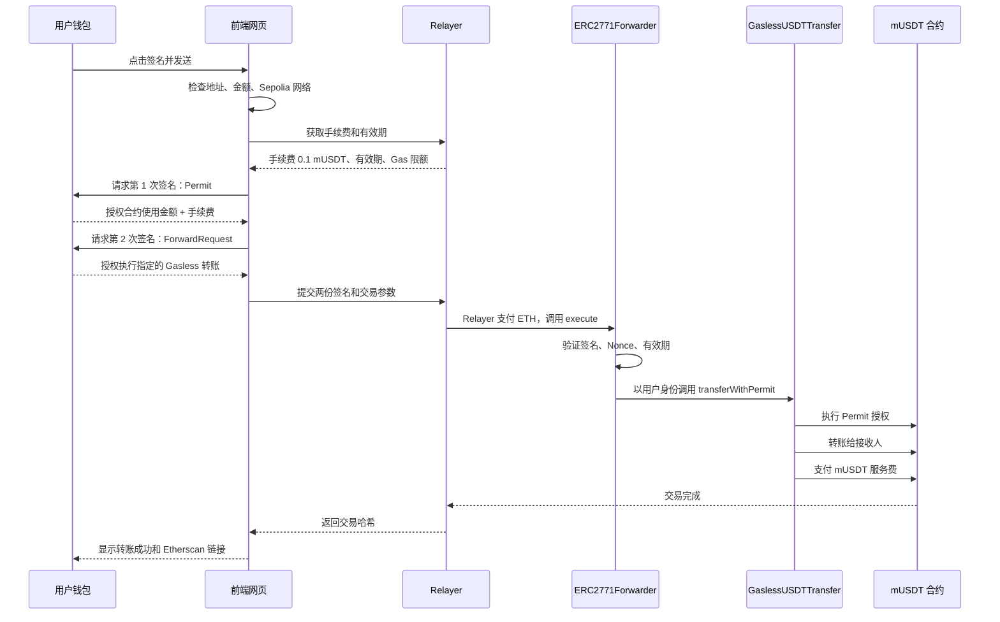

# Gasless mUSDT：点击“签名并发送”后的完整流程

点击“签名并发送”后，并不是用户直接发送链上交易，而是：

> 用户签署两份授权书 → Relayer 拿着授权书代替用户发送交易 → 用户支付 mUSDT，Relayer 支付 ETH Gas。

## 参与者分别做什么

| 角色 | 作用 |
| --- | --- |
| 用户钱包 | 保存私钥，签署两份授权，但不支付 ETH |
| 前端网页 | 收集地址、数量，组织签名内容 |
| Relayer | 验证签名，并用自己的 Sepolia ETH 发送交易 |
| ERC2771Forwarder | 验证用户确实授权了这次调用 |
| GaslessUSDTTransfer | 执行 Permit、转账和服务费扣款 |
| MockUSDT | 当前演示使用的 mUSDT 代币 |

## 完整流程



## 第一步：前端检查

点击后，网页首先检查：

- 是否检测到 MetaMask
- 当前钱包是否连接
- 网络是不是 Sepolia
- 接收地址是不是合法的 `0x...` 地址
- 数量是否大于 0
- 是否超过 Relayer 单笔限额
- Relayer 服务是否正常

当前服务费为 `0.1 mUSDT`，合约规定服务费不能超过转账金额的 5%，所以最少需要发送：

```text
0.1 ÷ 5% = 2 mUSDT
```

因此发送数量不能低于 `2 mUSDT`。

## 第二步：获取报价

网页调用 Relayer：

```http
GET /quote?amount=2000000
```

因为 mUSDT 有 6 位小数：

```text
2 mUSDT = 2,000,000
```

Relayer 返回：

- 服务费：`0.1 mUSDT`
- ForwardRequest Gas 限额：`300000`
- 签名有效期：大约 10 分钟

这一步还没有签名，也没有链上交易。

## 第三步：第一次签名——Permit

MetaMask 第一次弹窗是 EIP-2612 Permit 签名。

它表达的是：

> 我允许 GaslessUSDTTransfer 合约使用我的“转账金额 + 服务费”。

例如发送 `2 mUSDT`：

```text
接收人获得：2 mUSDT
服务费：    0.1 mUSDT
授权总额：  2.1 mUSDT
```

签名内容还包括：

- 用户地址
- 被授权的合约地址
- 授权数量
- Permit Nonce
- 过期时间
- mUSDT 合约地址
- Sepolia Chain ID

这只是离线签名：

- 不广播交易
- 不消耗 ETH
- 不会立即转走代币
- 网页拿不到用户私钥

## 第四步：构造合约调用

前端把第一次签名编码进下面的调用：

```solidity
transferWithPermit(
    recipient,
    amount,
    fee,
    permitDeadline,
    v,
    r,
    s
)
```

其中 `v/r/s` 是 Permit 签名拆分后的结果。

## 第五步：第二次签名——ForwardRequest

MetaMask 第二次弹窗授权的是：

> 我允许 ERC2771Forwarder 代表我执行上面这个指定的合约调用。

签名内容包括：

- `from`：用户地址
- `to`：GaslessUSDTTransfer 合约
- `value`：0 ETH
- `gas`：最多允许使用的 Gas
- `nonce`：防止重复执行
- `deadline`：过期时间
- `data`：完整的转账调用数据

第二次也只是签名，不消耗 ETH。

两次签名的区别可以简单理解为：

- Permit：允许合约使用这笔 mUSDT
- ForwardRequest：允许 Relayer 执行这次指定转账

## 第六步：发送给 Relayer

前端把第二份签名和交易内容发送到：

```http
POST /relay
```

Relayer 不会直接盲目发送，而是先检查：

- 签名是否正确
- 用户地址是否匹配
- 目标合约是否是指定合约
- 调用方法是否为允许的方法
- 金额是否超过限制
- 服务费是否被篡改
- Gas 是否超过限制
- Nonce 是否正确
- 签名是否过期
- 交易模拟是否成功

只有全部通过，Relayer 才会提交交易。

## 第七步：Relayer 支付 ETH

Relayer 使用自己的钱包私钥，向 Forwarder 发送真正的 Sepolia 交易：

```solidity
forwarder.execute(forwardRequest)
```

这里：

- 用户支付：`0 ETH`
- Relayer 支付：Sepolia ETH Gas
- 用户最终承担：mUSDT 服务费

所以“用户无 Gas”不代表整个系统不需要 Gas，而是由 Relayer 代付。

## 第八步：Forwarder 验证用户

Forwarder 检查：

- EIP-712 签名
- Nonce
- Deadline
- 用户地址
- 调用数据

验证通过后，Forwarder 调用 `GaslessUSDTTransfer`，并把原始用户地址附加到调用数据末尾。

因此 `GaslessUSDTTransfer` 通过 ERC-2771 的 `_msgSender()` 获得的仍然是用户地址，而不是 Relayer 地址。

## 第九步：执行 mUSDT 转账

`GaslessUSDTTransfer` 依次执行：

1. 用第一次签名调用 mUSDT 的 `permit()`
2. 获得“金额 + 服务费”的 allowance
3. 从用户转出发送金额给接收人
4. 从用户转出服务费给 Treasury
5. 发出 `GaslessTransfer` 事件

以成功交易为例：

```text
用户减少：       2.1 mUSDT
接收人获得：     2 mUSDT
Treasury 获得：  0.1 mUSDT
用户支付 ETH：   0
Relayer 支付 ETH：Gas 费用
```

## 第十步：返回结果

Relayer 等待交易被确认，然后把以下内容返回给网页：

- Transaction Hash
- 状态
- 区块号

前端显示成功，并刷新用户余额。

本项目的一笔成功示例：

- 交易哈希：`0xf1836cf3b58865276aef577fd9306beb81d4af6396a435a0e506feb4eac841a1`
- 区块：`11382729`
- 转账金额：`2 mUSDT`
- 服务费：`0.1 mUSDT`
- Etherscan：<https://sepolia.etherscan.io/tx/0xf1836cf3b58865276aef577fd9306beb81d4af6396a435a0e506feb4eac841a1>

## 为什么需要两次签名？

如果只有 Permit 签名，Relayer 只能获得代币使用授权，但没有获得“执行这次具体交易”的授权。

如果只有 ForwardRequest 签名，合约虽然可以执行调用，却没有权限从用户钱包扣除 mUSDT。

因此需要两份授权：

```text
Permit 签名
  └─ 授权使用 2.1 mUSDT

ForwardRequest 签名
  └─ 授权执行“给某地址转 2 mUSDT、收 0.1 mUSDT 手续费”
```

## 安全保护

当前系统有以下限制：

- Nonce 防止签名重复使用
- Deadline 防止旧签名永久有效
- Permit 只授权本次金额和手续费
- ForwardRequest 绑定具体接收人和数量
- Relayer 不能随意修改接收地址
- Relayer 不能提高服务费
- Relayer 只能调用白名单合约和方法
- 用户私钥始终保存在 MetaMask 中

## 常见失败情况

### 用户取消签名

如果用户取消任意一次签名，不会产生链上交易，也不会扣除代币。

### mUSDT 余额不足

用户需要拥有：

```text
转账金额 + 服务费
```

例如发送 `2 mUSDT` 时，至少需要 `2.1 mUSDT`。

### Relayer ETH 不足

用户虽然不需要 ETH，但 Relayer 必须持有足够的 Sepolia ETH 才能支付 Gas。

### 页面等待超时

`POST /relay` 需要等待链上确认。即使网页超时，交易也可能已经提交，所以不能立即重复发送，应先检查 Etherscan。

当前前端配置为：

- 配置和报价请求：10 秒超时
- 链上提交和确认：120 秒超时

### 签名过期

报价和签名通常只在约 10 分钟内有效。过期后需要重新获取报价并重新签名。

## 关于真实 USDT

当前项目使用的是支持 EIP-2612 Permit 的测试代币 `MockUSDT`，不是真实美元资产。

真实以太坊 USDT 通常不能直接使用本项目的 EIP-2612 Permit 流程。生产环境如果需要支持真实 USDT，一般需要考虑：

- Permit2
- 用户提前执行一次 `approve`
- 账户抽象与 Paymaster
- 支持代币手续费的智能账户

