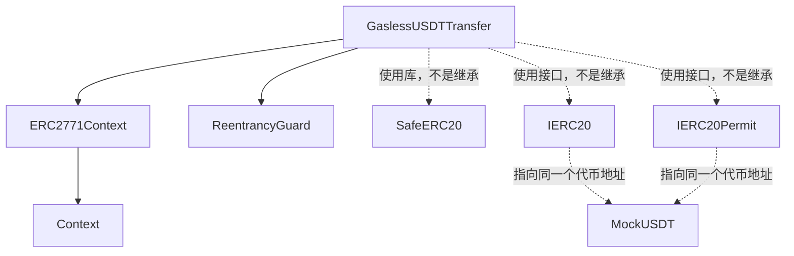
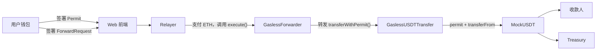
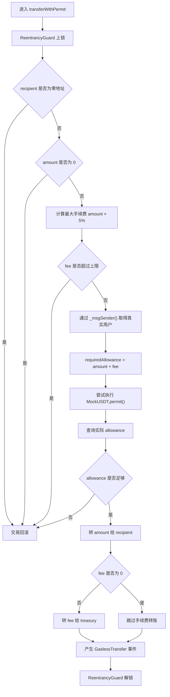

# GaslessUSDTTransfer 合约完整逻辑与继承关系

`GaslessUSDTTransfer` 是系统里的“业务执行合约”。它不负责验证 ForwardRequest，也不直接支付 Gas；它负责：

1. 从 ERC-2771 调用中识别真实用户。
2. 使用用户签署的 Permit 完成代币授权。
3. 从用户账户转出 mUSDT。
4. 把转账金额发送给收款人。
5. 把手续费发送给固定 Treasury。
6. 限制手续费最高不超过转账金额的 5%。
7. 防止重入攻击。

源码：[`contracts/GaslessUSDTTransfer.sol`](../contracts/GaslessUSDTTransfer.sol)

项目使用 OpenZeppelin Contracts `5.6.1`。

## 一、继承与依赖关系



真正的 Solidity 继承关系是：

```text
GaslessUSDTTransfer
├── ERC2771Context
│   └── Context
└── ReentrancyGuard
```

另外，它使用了三个工具，但没有继承它们：

```text
IERC20
用 ERC-20 标准方式查询授权和转账

IERC20Permit
用 EIP-2612 Permit 签名设置授权

SafeERC20
安全包装 transferFrom()
```

## 二、这个合约在整个系统中的位置



各组件分工是：

| 组件 | 作用 |
|---|---|
| 用户 | 只签名，不发送链上交易 |
| Relayer | 发送交易并支付 Sepolia ETH |
| GaslessForwarder | 验证外层签名、Nonce、Deadline |
| GaslessUSDTTransfer | 执行具体的代币转账业务 |
| MockUSDT | 保存余额、Permit Nonce 和 Allowance |
| Treasury | 接收 mUSDT 手续费 |

`GaslessUSDTTransfer` 可以理解成：

```text
经过限制的 mUSDT 转账代理
```

它不是一个通用的任意调用合约。

## 三、状态变量和常量

### 1. `MAX_FEE_BPS`

```solidity
uint256 public constant MAX_FEE_BPS = 500;
```

`BPS` 是“基点”，英文 Basis Points。

```text
10,000 BPS = 100%
500 BPS    = 5%
100 BPS    = 1%
1 BPS      = 0.01%
```

所以：

```text
MAX_FEE_BPS = 500 = 5%
```

这个常量是 `public`，部署后可以查询：

```solidity
MAX_FEE_BPS()
```

但不能修改。

### 2. `BPS_DENOMINATOR`

```solidity
uint256 private constant BPS_DENOMINATOR = 10_000;
```

这是手续费计算的分母。

它是 `private`，外部不能直接查询。

手续费上限计算：

```solidity
maximumFee =
    amount * 500 / 10_000;
```

也就是：

```text
maximumFee = amount × 5%
```

### 3. `token`

```solidity
IERC20 public immutable token;
```

保存允许转账的代币地址。

当前项目中，它指向：

```text
MockUSDT 合约
```

这个变量使用 `IERC20` 接口，主要调用：

```solidity
token.allowance(...)
token.safeTransferFrom(...)
```

`public` 会自动生成查询函数：

```solidity
token()
```

`immutable` 表示：

```text
只能在构造函数中设置一次
部署后不能修改
```

### 4. `permitToken`

```solidity
IERC20Permit public immutable permitToken;
```

它和 `token` 指向同一个代币地址，只是使用不同接口解释这个地址。

可以理解为：

```text
token
把 MockUSDT 看成普通 ERC-20

permitToken
把同一个 MockUSDT 看成支持 Permit 的 ERC-20
```

主要调用：

```solidity
permitToken.permit(...)
```

外部可以查询：

```solidity
permitToken()
```

正常情况下：

```text
token() == permitToken()
```

### 5. `treasury`

```solidity
address public immutable treasury;
```

这是接收 mUSDT 手续费的地址。

部署后不能修改。

每次有手续费时，合约执行：

```text
用户 → Treasury
```

而不是：

```text
用户 → Relayer 钱包
```

因此 Relayer 和 Treasury 可以是不同地址。

## 四、为什么 token 和 permitToken 是同一个地址

构造函数里：

```solidity
token = IERC20(token_);
permitToken = IERC20Permit(token_);
```

这不会部署两个代币，也不会复制合约。

只是把同一个地址分别当作两个接口使用：

```text
同一个 MockUSDT 地址
        │
        ├── 用 IERC20 接口调用 allowance/transferFrom
        │
        └── 用 IERC20Permit 接口调用 permit
```

类似于同一个人在不同场景拥有两个身份：

```text
作为 ERC-20：可以查询余额、授权和转账
作为 Permit Token：可以验证签名授权
```

## 五、构造函数逻辑

```solidity
constructor(
    address token_,
    address trustedForwarder_,
    address treasury_
) ERC2771Context(trustedForwarder_) {
    if (
        token_ == address(0) ||
        trustedForwarder_ == address(0) ||
        treasury_ == address(0)
    ) {
        revert ZeroAddress();
    }

    token = IERC20(token_);
    permitToken = IERC20Permit(token_);
    treasury = treasury_;
}
```

部署时需要三个参数：

| 顺序 | 参数 | 项目中传入的内容 |
|---:|---|---|
| 1 | `token_` | MockUSDT 地址 |
| 2 | `trustedForwarder_` | GaslessForwarder 地址 |
| 3 | `treasury_` | 手续费接收地址 |

项目部署脚本：

```typescript
const recipient = await viem.deployContract(
  "GaslessUSDTTransfer",
  [
    token.address,
    forwarder.address,
    treasury,
  ],
);
```

### 零地址检查

三个参数都不能是：

```text
0x0000000000000000000000000000000000000000
```

否则抛出：

```solidity
ZeroAddress()
```

### 构造函数没有检查的内容

它只检查地址不为零，没有检查：

- `token_` 是否真的部署了合约；
- Token 是否真的实现 ERC-20；
- Token 是否实现 EIP-2612 Permit；
- `trustedForwarder_` 是否真的是 ERC2771Forwarder；
- Treasury 是普通钱包还是合约；
- 这些地址是否属于同一套部署。

如果部署时传错了非零地址，合约仍可能部署成功，但运行时会失败。

### 地址不能更新

合约没有 Owner，也没有管理函数。

部署以后不能修改：

- Token；
- Trusted Forwarder；
- Treasury；
- 最大手续费比例。

如果配置错误，只能重新部署。

## 六、`transferWithPermit()` 参数

这是合约唯一的业务入口：

```solidity
function transferWithPermit(
    address recipient,
    uint256 amount,
    uint256 fee,
    uint256 permitDeadline,
    uint8 v,
    bytes32 r,
    bytes32 s
) external nonReentrant
```

参数含义：

| 参数 | 作用 |
|---|---|
| `recipient` | 接收 mUSDT 的地址 |
| `amount` | 收款人收到的代币数量，不包含手续费 |
| `fee` | 发送到 Treasury 的 mUSDT 手续费 |
| `permitDeadline` | Permit 签名过期时间 |
| `v` | Permit 签名的一部分 |
| `r` | Permit 签名的一部分 |
| `s` | Permit 签名的一部分 |

例如用户发送：

```text
amount = 25 mUSDT
fee    = 0.01 mUSDT
```

由于 MockUSDT 使用 6 位小数，实际参数是：

```text
amount = 25,000,000
fee    =     10,000
```

需要的总授权是：

```text
25,010,000
```

## 七、`transferWithPermit()` 完整处理顺序



## 八、第一步：重入保护

函数带有：

```solidity
nonReentrant
```

它来自 `ReentrancyGuard`。

在函数真正执行前，状态从：

```text
NOT_ENTERED = 1
```

改成：

```text
ENTERED = 2
```

执行完成后再改回：

```text
NOT_ENTERED = 1
```

如果执行过程中，Token 合约或其他外部合约再次调用：

```solidity
transferWithPermit(...)
```

会检测到状态已经是 `ENTERED`，然后抛出：

```solidity
ReentrancyGuardReentrantCall()
```

## 九、第二步：检查收款地址

```solidity
if (recipient == address(0)) {
    revert ZeroAddress();
}
```

不允许把代币发送给零地址。

对于标准 ERC-20 来说，把代币转到零地址通常代表销毁或非法操作。

注意，合约只禁止零地址，没有禁止：

- `recipient == sender`
- `recipient == treasury`
- `recipient == GaslessUSDTTransfer`
- `recipient` 是另一个智能合约

如果把收款地址填写成 `GaslessUSDTTransfer` 自身，代币可能进入本合约，而本合约没有代币救援函数，因此可能无法取回。

## 十、第三步：检查转账金额

```solidity
if (amount == 0) {
    revert ZeroAmount();
}
```

要求发送给收款人的金额必须大于零。

但是手续费允许为零：

```text
amount > 0
fee >= 0
```

是否愿意赞助零手续费交易，由 Relayer 的服务器策略决定。

当前 Relayer 会要求手续费等于它的报价。

## 十一、第四步：计算手续费上限

```solidity
uint256 maximumFee =
    (amount * MAX_FEE_BPS) /
    BPS_DENOMINATOR;
```

代入常量：

```solidity
maximumFee =
    amount * 500 / 10_000;
```

也就是：

```text
maximumFee = amount × 5%
```

然后检查：

```solidity
if (fee > maximumFee) {
    revert FeeTooHigh(fee, maximumFee);
}
```

### 示例一：发送 25 mUSDT

```text
amount = 25 mUSDT
最大手续费 = 25 × 5%
           = 1.25 mUSDT
```

只要：

```text
fee <= 1.25 mUSDT
```

合约层面就允许。

当前项目实际手续费通常是：

```text
0.01 mUSDT
```

远低于上限。

### 示例二：发送 1 mUSDT

```text
最大手续费 = 1 × 5%
           = 0.05 mUSDT
```

如果设置：

```text
fee = 0.06 mUSDT
```

合约会回滚。

项目测试覆盖了这个情况。

### 整数除法

Solidity 的整数除法会向下取整。

例如极小的转账金额可能计算出：

```text
maximumFee = 0
```

这时链上只允许：

```text
fee = 0
```

Relayer 的 `/quote` 接口会提前拒绝“金额太小、无法覆盖固定手续费”的请求。

### 链上限制与 Relayer 限制的区别

合约只要求：

```text
fee <= amount 的 5%
```

它没有要求手续费必须等于 0.01 mUSDT。

服务器 Relayer 另外要求：

```text
fee == 当前报价
```

所以：

```text
合约负责保证手续费不能过高
Relayer 负责保证手续费不能低于当前服务报价
```

## 十二、第五步：识别真实发送者

```solidity
address sender = _msgSender();
```

这里没有使用：

```solidity
msg.sender
```

而是使用 ERC2771Context 提供的：

```solidity
_msgSender()
```

因为在元交易中：

```text
msg.sender = GaslessForwarder
真实用户   = request.from
```

Forwarder 会把用户地址追加到 calldata 最后 20 字节。

ERC2771Context 检查调用者确实是可信 Forwarder 后，读取最后 20 字节作为真实用户。

所以：

```text
msg.sender   = GaslessForwarder
_msgSender() = 用户钱包
```

这个 `sender` 会被用于：

- Permit 的 `owner`；
- Allowance 的 `owner`；
- `transferFrom()` 的 `from`；
- `GaslessTransfer` 事件的 `sender`。

## 十三、第六步：计算总授权

```solidity
uint256 requiredAllowance =
    amount + fee;
```

用户需要授权的不是单纯的转账金额，而是：

```text
转账金额 + Relayer 服务费
```

例如：

```text
amount = 25 mUSDT
fee    = 0.01 mUSDT
```

则：

```text
requiredAllowance = 25.01 mUSDT
```

这个合约是 Spender：

```text
owner   = 用户
spender = GaslessUSDTTransfer
value   = amount + fee
```

不是：

```text
spender = Relayer
```

因此 Relayer 钱包不会直接得到用户的代币授权。

## 十四、第七步：调用 Permit

代码：

```solidity
try permitToken.permit(
    sender,
    address(this),
    requiredAllowance,
    permitDeadline,
    v,
    r,
    s
) {
} catch {
}
```

对应关系：

| Permit 参数 | 传入值 |
|---|---|
| `owner` | `_msgSender()` 得到的真实用户 |
| `spender` | `GaslessUSDTTransfer` 自己 |
| `value` | `amount + fee` |
| `deadline` | 用户签署的 Permit 截止时间 |
| `v/r/s` | 用户 Permit 签名 |

成功后，MockUSDT 内部状态大致是：

```text
allowance[user][GaslessUSDTTransfer]
    = amount + fee
```

并且 MockUSDT Permit nonce 增加 1。

### 为什么使用 `try/catch`

合约故意忽略 Permit 调用失败：

```solidity
try permit(...) {
} catch {
}
```

这不是忘记处理错误，而是 OpenZeppelin 推荐的一种 Permit 使用模式。

Permit 签名可以由任何人提交，因此可能出现：

1. 用户签署 Permit。
2. 某人提前把这个 Permit 提交到 MockUSDT。
3. Permit nonce 已经增加。
4. 正常交易再次调用同一份 Permit。
5. 第二次 Permit 因 nonce 已使用而失败。

虽然第二次 Permit 失败，但第一次 Permit 已经设置好了授权。

因此业务合约不应该仅仅因为 Permit 第二次失败就终止，而应该继续检查实际 Allowance。

### Permit 失败也可能继续执行

以下 Permit 错误都会被暂时忽略：

- 签名错误；
- 签名过期；
- Nonce 不正确；
- 签名人不匹配；
- Token 不支持 Permit；
- Permit 已经被提前提交。

但下一步必须满足：

```text
实际 allowance >= amount + fee
```

否则仍然回滚。

### 一个重要细节

如果用户之前已经给该合约足够授权，那么即使本次 Permit 签名无效或过期，交易仍可能执行。

原因是本合约最终依赖的是：

```text
实际有效的 Allowance
```

Permit 只是获得 Allowance 的一种方式。

这不会让攻击者随意转走用户代币，因为：

- ERC-2771 路径仍需要用户签署有效 ForwardRequest；
- 直接调用时 `_msgSender()` 是直接调用者自己；
- 转账参数包含在 ForwardRequest 签名中；
- Forwarder Nonce 防止重复提交。

## 十五、第八步：检查实际授权

```solidity
uint256 currentAllowance =
    token.allowance(
        sender,
        address(this)
    );
```

查询：

```text
用户允许 GaslessUSDTTransfer 使用多少代币
```

然后：

```solidity
if (currentAllowance < requiredAllowance) {
    revert PermitOrAllowanceInsufficient(
        currentAllowance,
        requiredAllowance
    );
}
```

例如：

```text
需要授权：25.01 mUSDT
实际授权：20 mUSDT
```

会抛出：

```text
PermitOrAllowanceInsufficient(
    20 mUSDT,
    25.01 mUSDT
)
```

因为 Permit 错误被 `try/catch` 隐藏，所以前端有时看到的是：

```text
授权不足
```

而不是更具体的：

```text
Permit 已过期
Permit Nonce 错误
Permit 签名错误
```

这是容忍 Permit 被提前提交带来的调试取舍。

## 十六、第九步：把金额转给收款人

```solidity
token.safeTransferFrom(
    sender,
    recipient,
    amount
);
```

在 MockUSDT 看来：

```text
msg.sender = GaslessUSDTTransfer
from       = 用户
to         = 收款人
value      = amount
```

MockUSDT 会检查：

```text
用户余额 >= amount
allowance[user][GaslessUSDTTransfer] >= amount
```

成功后：

```text
用户余额减少 amount
收款人余额增加 amount
授权额度减少 amount
```

注意，代币不会先进入 `GaslessUSDTTransfer`。

路径是直接的：

```text
用户 → 收款人
```

## 十七、第十步：把手续费转给 Treasury

```solidity
if (fee != 0) {
    token.safeTransferFrom(
        sender,
        treasury,
        fee
    );
}
```

如果手续费为零，则跳过第二次代币转账。

如果手续费不为零，路径是：

```text
用户 → Treasury
```

而不是：

```text
用户 → GaslessUSDTTransfer → Treasury
```

所以正常情况下，业务合约自己不会持有用户的 mUSDT。

### 授权如何被消耗

假设 Permit 设置：

```text
allowance = amount + fee
```

第一次转账：

```text
allowance -= amount
```

剩余：

```text
allowance = fee
```

第二次转账：

```text
allowance -= fee
```

最终通常为：

```text
allowance = 0
```

因此每次 Permit 只授权本次转账需要的精确金额，没有无限授权。

如果 Permit 失败但用户之前有更高授权，执行完成后可能仍有剩余 Allowance。

## 十八、第十一步：产生事件

```solidity
emit GaslessTransfer(
    sender,
    recipient,
    amount,
    fee,
    msg.sender
);
```

事件定义：

```solidity
event GaslessTransfer(
    address indexed sender,
    address indexed recipient,
    uint256 amount,
    uint256 fee,
    address indexed relayer
);
```

字段含义：

| 字段 | 实际内容 |
|---|---|
| `sender` | 真实用户地址 |
| `recipient` | mUSDT 收款地址 |
| `amount` | 发送给收款人的金额 |
| `fee` | 发送给 Treasury 的手续费 |
| `relayer` | 当前代码传入的 `msg.sender` |

前三个地址字段使用 `indexed`，便于日志查询。

### `relayer` 字段的命名问题

通过 Forwarder 调用时：

```text
msg.sender   = GaslessForwarder
_msgSender() = 真实用户
tx.from      = Relayer 钱包
```

当前事件传入：

```solidity
msg.sender
```

所以事件里的 `relayer` 实际记录的是：

```text
GaslessForwarder 合约地址
```

不是服务器的 Relayer EOA。

真实 Relayer 钱包需要从链上交易的顶层 `from` 查询。

因此这个事件字段更准确的名称应该类似：

```text
forwarder
```

当前名称容易引起误解。

直接调用时，该字段记录的是直接调用者。

## 十九、整笔交易的原子性

Permit、两次代币转账和事件都发生在同一笔交易里。

正常路径：

```text
permit
→ 转 amount
→ 转 fee
→ 产生事件
```

如果手续费转账失败，即使第一笔收款人转账已经执行，整笔交易最终仍会回滚：

```text
Permit 授权回滚
Permit nonce 回滚
收款人余额回滚
Treasury 余额回滚
Allowance 回滚
GaslessTransfer 事件回滚
ReentrancyGuard 状态回滚
```

所以不会出现：

```text
收款人收到钱，但手续费没扣
```

或者：

```text
Permit 成功，但业务转账失败后仍留下本次授权
```

前提是所使用的 Token 遵循正常 EVM 调用和回滚规则。

## 二十、ERC2771Context 的完整作用

源码：[`ERC2771Context.sol`](../node_modules/@openzeppelin/contracts/metatx/ERC2771Context.sol)

### 保存可信 Forwarder

```solidity
address private immutable _trustedForwarder;
```

构造函数：

```solidity
constructor(address trustedForwarder_) {
    _trustedForwarder = trustedForwarder_;
}
```

`GaslessUSDTTransfer` 部署时会传入 GaslessForwarder 地址。

### `trustedForwarder()`

```solidity
function trustedForwarder()
    public
    view
    returns (address)
```

返回当前可信 Forwarder 地址。

### `isTrustedForwarder(forwarder)`

```solidity
function isTrustedForwarder(
    address forwarder
) public view returns (bool)
```

检查：

```text
forwarder == trustedForwarder
```

`GaslessForwarder.verify()` 会调用这个函数，确认目标合约确实信任它。

### `_msgSender()`

处理逻辑：

```solidity
if (
    msg.sender 是可信 Forwarder
    &&
    msg.data 至少包含 20 字节后缀
) {
    返回 calldata 最后 20 字节
} else {
    返回普通 msg.sender
}
```

所以：

| 调用方式 | `_msgSender()` |
|---|---|
| 用户直接调用 | 用户 |
| 正确 Forwarder 调用 | calldata 末尾记录的用户 |
| 非可信合约调用 | 非可信合约本身 |
| 攻击者直接追加假地址 | 攻击者自己 |

攻击者不能通过直接在 calldata 后面添加其他用户地址来伪造身份，因为特殊解析只对可信 Forwarder 生效。

### `_msgData()`

如果来自可信 Forwarder，它会去掉末尾的 20 字节用户地址，返回原始函数调用数据。

当前业务函数没有直接使用 `_msgData()`，但这是 ERC-2771 的标准组成部分。

### `_contextSuffixLength()`

返回：

```text
20
```

因为 EVM 地址是 20 字节。

### ERC2771Context 的安全注意事项

它不适合与依赖精确 calldata 长度的特殊逻辑混用。

对自身进行 `delegatecall` 也可能破坏 ERC-2771 上下文。

当前 `GaslessUSDTTransfer`：

- 没有 `delegatecall`；
- 没有复杂 fallback；
- 没有依赖精确 calldata 长度；

因此没有直接触发这些风险。

## 二十一、ReentrancyGuard 的完整作用

源码：[`ReentrancyGuard.sol`](../node_modules/@openzeppelin/contracts/utils/ReentrancyGuard.sol)

状态值：

```solidity
uint256 private constant NOT_ENTERED = 1;
uint256 private constant ENTERED = 2;
```

部署时初始化：

```text
状态 = NOT_ENTERED
```

`nonReentrant` 的逻辑可以简化为：

```solidity
modifier nonReentrant() {
    require(status != ENTERED);
    status = ENTERED;

    _;

    status = NOT_ENTERED;
}
```

### 为什么这里需要防重入

`transferWithPermit()` 会多次调用外部 Token：

```text
permit()
allowance()
transferFrom()
transferFrom()
```

如果 Token 是恶意合约，它可能在这些外部调用中尝试重新调用：

```solidity
GaslessUSDTTransfer.transferWithPermit(...)
```

`nonReentrant` 会阻止这种嵌套调用。

### 一个全局锁

ReentrancyGuard 只有一个锁。

因此同一合约中，两个标记为 `nonReentrant` 的函数不能互相直接调用。

当前合约只有一个 `nonReentrant` 入口，所以不存在这个问题。

### 回滚后的状态

如果函数中途回滚，整个 EVM 状态回滚，重入状态也会恢复，不会永久卡在 `ENTERED`。

## 二十二、SafeERC20 的完整作用

源码：[`SafeERC20.sol`](../node_modules/@openzeppelin/contracts/token/ERC20/utils/SafeERC20.sol)

合约声明：

```solidity
using SafeERC20 for IERC20;
```

这使得：

```solidity
SafeERC20.safeTransferFrom(
    token,
    sender,
    recipient,
    amount
);
```

可以写成：

```solidity
token.safeTransferFrom(
    sender,
    recipient,
    amount
);
```

### 为什么不用普通 `transferFrom()`

标准 ERC-20 定义 `transferFrom()` 返回 `bool`。

但现实中的 Token 实现不完全统一：

```text
有些成功时返回 true
有些成功时不返回任何数据
有些失败时返回 false
有些失败时直接 revert
```

SafeERC20 兼容这些情况。

### SafeERC20 判断逻辑

#### 返回 `true`

认为成功。

#### 返回 `false`

抛出：

```solidity
SafeERC20FailedOperation(token)
```

#### 不返回数据，但调用没有回滚

如果 Token 地址确实有合约代码，则认为成功。

这可以兼容某些历史 ERC-20 实现。

#### Token 调用直接回滚

SafeERC20 会把 Token 的原始错误继续向上传递。

### SafeERC20 不能解决什么

SafeERC20 只能改善返回值兼容性，不能保证：

- Token 合约不是恶意的；
- Token 一定支持 Permit；
- Token 没有转账税；
- 收款人实际收到的数量等于参数；
- Token 不会执行回调；
- Token 价格稳定；
- Token 与真实美元挂钩。

## 二十三、IERC20 和 IERC20Permit 的作用

### IERC20

源码：[`IERC20.sol`](../node_modules/@openzeppelin/contracts/token/ERC20/IERC20.sol)

这里只使用：

```solidity
allowance(owner, spender)
transferFrom(from, to, value)
```

`IERC20` 是接口，不包含余额实现。

真正的余额、授权和转账逻辑位于 MockUSDT 的 ERC20 父合约中。

### IERC20Permit

源码：[`IERC20Permit.sol`](../node_modules/@openzeppelin/contracts/token/ERC20/extensions/IERC20Permit.sol)

这里只使用：

```solidity
permit(
    owner,
    spender,
    value,
    deadline,
    v,
    r,
    s
)
```

代币必须正确实现 EIP-2612 Permit。

项目里的 `MockUSDT` 通过继承：

```solidity
ERC20Permit
```

满足这个要求。

不能因为某个代币名字叫“USDT”就认为它一定支持标准 EIP-2612 Permit。替换成其他 USDT 合约前，必须确认其具体接口和签名格式。

## 二十四、直接调用与 Forwarder 调用的区别

### 通过 Forwarder 调用

```text
用户签名
Relayer 支付 ETH
GaslessForwarder 调用业务合约
```

业务合约内部：

```text
msg.sender   = GaslessForwarder
_msgSender() = 用户
```

用户不需要 ETH。

### 用户直接调用

用户也可以直接调用：

```solidity
transferWithPermit(...)
```

此时：

```text
msg.sender   = 用户
_msgSender() = 用户
```

功能仍然可以执行，但用户需要自己支付 ETH Gas。

### 攻击者直接提交别人的 Permit

假设攻击者拿到 Alice 的 Permit 参数，然后自己直接调用业务合约。

此时：

```text
_msgSender() = 攻击者
```

业务合约会尝试：

```solidity
permit(
    攻击者,
    GaslessUSDTTransfer,
    amount + fee,
    ...
)
```

但签名来自 Alice，因此 Permit 验证失败。

接着合约检查的是：

```text
allowance[攻击者][GaslessUSDTTransfer]
```

而不是 Alice 的授权。

所以攻击者不能用直接调用的方式花费 Alice 的代币。

项目测试覆盖了这个情况。

## 二十五、一次执行涉及几次 Token 调用

当 `fee != 0` 时，业务合约最多调用 Token 四次：

| 顺序 | Token 函数 | 作用 |
|---:|---|---|
| 1 | `permit()` | 尝试设置授权 |
| 2 | `allowance()` | 查询实际授权 |
| 3 | `transferFrom()` | 用户向收款人转金额 |
| 4 | `transferFrom()` | 用户向 Treasury 转手续费 |

如果：

```text
fee = 0
```

则只有一次 `transferFrom()`，最多三次 Token 调用。

如果 Permit 已经提前执行，第一步可能失败并被捕获，但后三步仍然可以继续。

## 二十六、全部公开函数

| 函数 | 来源 | 修改状态 | 作用 |
|---|---|---:|---|
| `MAX_FEE_BPS()` | GaslessUSDTTransfer | 否 | 返回最大手续费 500 BPS |
| `token()` | GaslessUSDTTransfer | 否 | 返回 ERC-20 地址 |
| `permitToken()` | GaslessUSDTTransfer | 否 | 返回 Permit Token 地址 |
| `treasury()` | GaslessUSDTTransfer | 否 | 返回手续费地址 |
| `trustedForwarder()` | ERC2771Context | 否 | 返回可信 Forwarder |
| `isTrustedForwarder(address)` | ERC2771Context | 否 | 检查某地址是否可信 |
| `transferWithPermit(...)` | GaslessUSDTTransfer | 是 | 执行授权、转账和手续费扣取 |

合约没有：

- Owner；
- 管理员函数；
- 地址修改函数；
- 暂停功能；
- 普通 ETH 提现；
- Token 救援函数；
- 用户余额账本；
- 自己的 Nonce；
- 自己的签名验证逻辑；
- 升级功能。

## 二十七、错误和失败原因

| 错误 | 原因 |
|---|---|
| `ZeroAddress()` | 部署参数或收款地址为零地址 |
| `ZeroAmount()` | 转账金额为零 |
| `FeeTooHigh(fee,maximum)` | 手续费超过金额的 5% |
| `PermitOrAllowanceInsufficient(current,required)` | Permit 失败且实际授权不足 |
| `ReentrancyGuardReentrantCall()` | 检测到重入调用 |
| `SafeERC20FailedOperation(token)` | Token 返回失败结果 |
| Token 自身错误 | 余额不足、授权不足、地址非法等 |

除此之外，前面的 Forwarder 还可能因为以下原因拒绝交易：

- ForwardRequest 签名错误；
- Forwarder Nonce 错误；
- ForwardRequest 过期；
- 目标合约不信任 Forwarder；
- Relayer 给出的 Gas 不足。

这些不是 `GaslessUSDTTransfer` 自己抛出的业务错误。

## 二十八、成功交易会产生哪些事件

Permit 正常成功、手续费非零时，通常会产生：

1. MockUSDT 的 `Approval`：

```text
用户授权 GaslessUSDTTransfer 使用 amount + fee
```

2. MockUSDT 的第一条 `Transfer`：

```text
用户 → 收款人：amount
```

3. MockUSDT 的第二条 `Transfer`：

```text
用户 → Treasury：fee
```

4. GaslessUSDTTransfer 的 `GaslessTransfer`：

```text
记录用户、收款人、金额、手续费和 Forwarder
```

5. GaslessForwarder 的 `ExecutedForwardRequest`：

```text
记录用户、Forwarder Nonce 和执行结果
```

如果 Permit 已提前提交，本次交易中可能没有新的 `Approval` 事件。

## 二十九、安全设计总结

### 固定 Token

```solidity
token = immutable
```

Relayer 不能把业务调用变成任意 Token 的赞助服务。

### 固定 Treasury

```solidity
treasury = immutable
```

调用者不能把手续费地址替换成自己的地址。

### 固定 Trusted Forwarder

```solidity
trustedForwarder = immutable
```

只有部署时指定的 Forwarder 才能声明真实用户身份。

### 手续费最高 5%

调用者和 Relayer 都不能通过这个函数扣取超过转账金额 5% 的手续费。

### 精确 Permit 授权

前端签署：

```text
amount + fee
```

正常情况下执行后 Allowance 回到零。

### 重入保护

Token 外部调用期间不能再次进入业务函数。

### 原子执行

任何一步失败，Permit 和全部转账一起回滚。

### 不保管用户资金

正常资金路径是：

```text
用户 → 收款人
用户 → Treasury
```

业务合约不需要先持有用户资金。

## 三十、需要特别注意的限制

1. `fee = 0` 在合约层面是允许的，固定手续费由 Relayer 服务器策略保证。
2. 合约不会检查 Token 地址是否真的支持 Permit。
3. Permit 失败原因会被 `try/catch` 隐藏，最终可能只看到授权不足。
4. 合约没有 Token 救援函数，误转入本合约的 Token 可能无法取回。
5. Treasury、Token、Forwarder 部署后都不能修改。
6. 当前事件的 `relayer` 字段实际记录 Forwarder，而不是 Relayer EOA。
7. 合约自己没有 Nonce；重放保护来自 MockUSDT Permit Nonce 和 GaslessForwarder Nonce。
8. 普通 EOA 可以产生 EIP-2612 签名，但部分智能合约钱包未必能使用当前 Permit 签名流程。
9. SafeERC20 不能保护系统免受恶意 Token 合约攻击。
10. 这是为固定 MockUSDT 和固定业务流程设计的合约，不是通用支付路由器。

## 最简理解

```text
ERC2771Context
负责找出“真正的用户是谁”

ReentrancyGuard
防止执行过程中再次进入函数

IERC20Permit
使用用户签名设置代币授权

IERC20
查询授权并执行 transferFrom

SafeERC20
兼容不同 ERC-20 的返回方式

GaslessUSDTTransfer
把授权、付款和手续费扣取组成一次原子操作
```

## 相关源码

- [`contracts/GaslessUSDTTransfer.sol`](../contracts/GaslessUSDTTransfer.sol)
- [`contracts/GaslessForwarder.sol`](../contracts/GaslessForwarder.sol)
- [`contracts/mocks/MockUSDT.sol`](../contracts/mocks/MockUSDT.sol)
- [`shared/contracts.ts`](../shared/contracts.ts)
- [`apps/web/src/main.ts`](../apps/web/src/main.ts)
- [`apps/relayer/src/index.ts`](../apps/relayer/src/index.ts)
- [`apps/relayer/src/policy.ts`](../apps/relayer/src/policy.ts)
- [`test/GaslessUSDTTransfer.ts`](../test/GaslessUSDTTransfer.ts)
