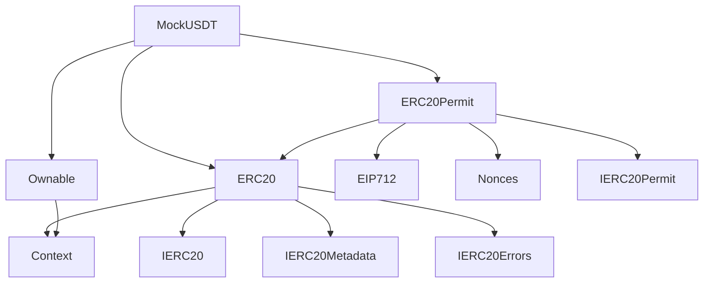
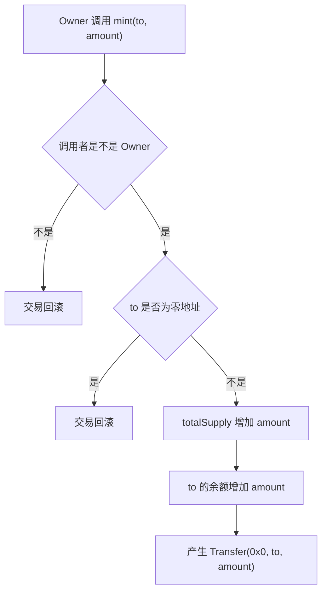
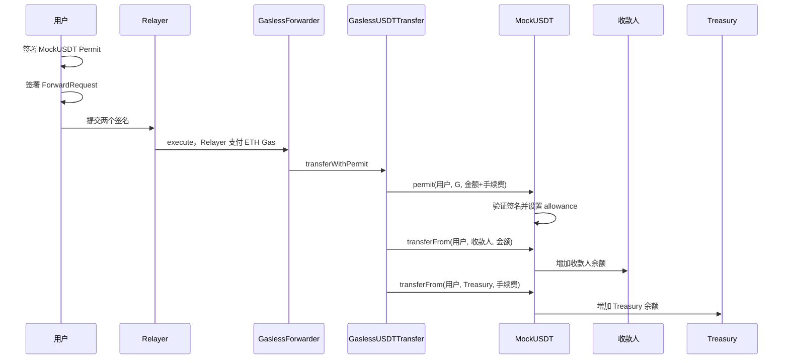

# MockUSDT 合约完整逻辑与继承关系

`MockUSDT` 是一个用于 Sepolia 测试网的“模拟 USDT”：

- 遵循 ERC-20 标准，可以查询余额、转账和授权。
- 使用 6 位小数，表现得像 USDT。
- 支持 EIP-2612 Permit，用户可以通过签名完成授权，不需要自己发送 `approve()` 交易。
- 只有 Owner 可以无限铸造测试代币。
- 它不是正式 USDT，不具备真实资产价值。

项目使用的是 OpenZeppelin Contracts `5.6.1`。

源码：[`contracts/mocks/MockUSDT.sol`](../contracts/mocks/MockUSDT.sol)

## 一、继承关系



虽然 `MockUSDT` 自己只有二十多行代码，但继承之后，它最终拥有 ERC-20、Permit 和 Owner 管理等一整套功能。

可以把它理解成：

```text
ERC20
提供代币功能

ERC20Permit
提供“签名授权”功能

Ownable
提供管理员权限

MockUSDT
把这些功能组合起来，并增加 6 位小数和 mint()
```

## 二、MockUSDT 自己实现了什么

核心代码是：

```solidity
contract MockUSDT is ERC20, ERC20Permit, Ownable {
    constructor(address initialOwner)
        ERC20("Mock USDT", "mUSDT")
        ERC20Permit("Mock USDT")
        Ownable(initialOwner)
    {}

    function decimals() public pure override returns (uint8) {
        return 6;
    }

    function mint(address to, uint256 amount) external onlyOwner {
        _mint(to, amount);
    }
}
```

它自己主要做了三件事：

1. 设置代币名称和符号。
2. 把小数位改成 6。
3. 增加一个只有 Owner 可以调用的铸币函数。

## 三、部署时执行的逻辑

部署代码传入：

```solidity
new MockUSDT(initialOwner)
```

项目的部署脚本传入的是部署钱包地址：

```typescript
const token = await viem.deployContract("MockUSDT", [
  deployer.account.address,
]);
```

部署过程中会分别调用三个父合约构造函数。

### 1. `ERC20("Mock USDT", "mUSDT")`

设置代币基本信息：

| 属性 | 值 |
|---|---|
| 名称 | `Mock USDT` |
| 符号 | `mUSDT` |
| 小数位 | 由 MockUSDT 重写为 `6` |

名称和符号部署后没有修改函数，因此不会再发生变化。

### 2. `ERC20Permit("Mock USDT")`

初始化 Permit 的 EIP-712 签名域：

```text
name              = Mock USDT
version           = 1
chainId           = 当前网络 Chain ID
verifyingContract = 当前 MockUSDT 合约地址
```

在 Sepolia 上，`chainId` 是 `11155111`。

这些信息可以防止签名被拿到其他网络或其他代币合约上重复使用。

### 3. `Ownable(initialOwner)`

把 `initialOwner` 设置为管理员。

如果传入零地址：

```text
0x0000000000000000000000000000000000000000
```

部署会失败，并抛出：

```solidity
OwnableInvalidOwner(address(0))
```

部署成功时还会产生：

```solidity
OwnershipTransferred(address(0), initialOwner)
```

### 4. 初始发行量

部署完成后：

```text
totalSupply = 0
所有地址余额 = 0
```

构造函数不会自动发行代币，必须由 Owner 调用 `mint()`。

## 四、为什么是 6 位小数

OpenZeppelin ERC20 默认返回 18：

```solidity
function decimals() public view virtual returns (uint8) {
    return 18;
}
```

`MockUSDT` 将其重写：

```solidity
function decimals() public pure override returns (uint8) {
    return 6;
}
```

所以合约里的最小单位关系是：

```text
1 mUSDT = 1,000,000 最小单位
```

例如：

| 用户看到的金额 | 合约中的整数 |
|---:|---:|
| 0.01 mUSDT | 10,000 |
| 1 mUSDT | 1,000,000 |
| 25 mUSDT | 25,000,000 |
| 1,000 mUSDT | 1,000,000,000 |

`decimals()` 只负责告诉钱包和前端如何显示金额，并不会自动参与合约计算。

因此代码里使用：

```typescript
parseUnits("1000", 6)
```

得到的实际整数是：

```text
1,000,000,000
```

## 五、ERC20 提供的逻辑

源码：[`ERC20.sol`](../node_modules/@openzeppelin/contracts/token/ERC20/ERC20.sol)

ERC20 在内部维护以下数据。

### 1. 余额

```solidity
mapping(address account => uint256) private _balances;
```

可以理解成一张表：

| 地址 | 余额 |
|---|---:|
| Alice | 100,000,000 |
| Bob | 20,000,000 |

通过下面的函数查询：

```solidity
balanceOf(address account)
```

### 2. 授权额度

```solidity
mapping(address account => mapping(address spender => uint256))
    private _allowances;
```

它记录：

```text
代币所有者允许某个 Spender 最多使用多少代币
```

例如：

```text
Alice 授权 GaslessUSDTTransfer 使用 25.01 mUSDT
```

可以表示成：

```text
_allowances[Alice][GaslessUSDTTransfer] = 25,010,000
```

通过下面的函数查询：

```solidity
allowance(owner, spender)
```

### 3. 总发行量

```solidity
uint256 private _totalSupply;
```

通过下面的函数查询：

```solidity
totalSupply()
```

铸币时增加，销毁代币时减少。

但当前 `MockUSDT` 没有提供公开的销毁函数。

## 六、ERC20 的公开函数

### `name()`

```solidity
function name() public view returns (string)
```

返回：

```text
Mock USDT
```

### `symbol()`

返回：

```text
mUSDT
```

### `decimals()`

返回：

```text
6
```

### `totalSupply()`

返回当前已经铸造并且尚未销毁的代币总量。

### `balanceOf(account)`

返回指定地址的余额。

### `transfer(to, value)`

由调用者把自己的代币转给 `to`：

```text
msg.sender → to
```

例如 Alice 调用：

```solidity
transfer(Bob, 10_000_000)
```

结果是：

```text
Alice -10 mUSDT
Bob   +10 mUSDT
```

要求：

- 收款地址不能是零地址。
- Alice 的余额必须足够。

成功时产生：

```solidity
Transfer(Alice, Bob, 10_000_000)
```

### `approve(spender, value)`

授权 `spender` 使用调用者的代币。

例如 Alice 调用：

```solidity
approve(GaslessUSDTTransfer, 25_010_000)
```

表示：

```text
GaslessUSDTTransfer 最多可以从 Alice 账户转走 25.01 mUSDT
```

它不会立即转走代币，只会记录授权额度。

成功时产生：

```solidity
Approval(Alice, GaslessUSDTTransfer, 25_010_000)
```

`approve()` 是一笔链上交易，因此正常情况下 Alice 需要 ETH 支付 Gas。项目使用 Permit，就是为了免掉这笔交易。

### `allowance(owner, spender)`

查询剩余授权：

```solidity
allowance(Alice, GaslessUSDTTransfer)
```

### `transferFrom(from, to, value)`

调用者使用已有授权，从 `from` 账户转出代币。

例如 `GaslessUSDTTransfer` 合约调用：

```solidity
token.transferFrom(Alice, Bob, 25_000_000)
```

ERC20 会检查：

```text
allowance[Alice][GaslessUSDTTransfer] >= 25,000,000
Alice 的余额 >= 25,000,000
```

成功后：

```text
Alice 的余额减少
Bob 的余额增加
授权额度减少
```

如果授权值是 `uint256` 的最大值，则被当作“无限授权”，`transferFrom()` 不会减少它。

## 七、ERC20 的内部转账核心 `_update()`

ERC20 的余额变化最终都进入：

```solidity
_update(from, to, value)
```

它根据地址是否为零地址，区分三种操作。

### 普通转账

```text
from != 0
to   != 0
```

执行：

```text
from 余额减少
to 余额增加
totalSupply 不变
```

并产生：

```solidity
Transfer(from, to, value)
```

### 铸币

```text
from = address(0)
to   = 用户地址
```

执行：

```text
totalSupply 增加
用户余额增加
```

产生：

```solidity
Transfer(address(0), to, value)
```

### 销毁

```text
from = 用户地址
to   = address(0)
```

执行：

```text
用户余额减少
totalSupply 减少
```

不过当前 `MockUSDT` 没有把 `_burn()` 暴露为公开函数，因此普通用户不能主动销毁 mUSDT。

## 八、MockUSDT 的 `mint()` 逻辑

代码：

```solidity
function mint(address to, uint256 amount) external onlyOwner {
    _mint(to, amount);
}
```

处理顺序如下：



例如 Owner 调用：

```solidity
mint(Alice, 1_000_000_000)
```

结果是：

```text
Alice 获得 1,000 mUSDT
totalSupply 增加 1,000 mUSDT
```

重要特点：

- 只有 Owner 能调用。
- 没有最大发行量。
- Owner 可以反复调用。
- Owner 理论上可以无限增发。
- 这是测试代币，不应该被视为真实稳定币。

Owner 虽然能无限增发，但不能直接扣除其他用户已有的代币，也不能绕过授权直接转走其他用户余额。

## 九、Ownable 提供的逻辑

源码：[`Ownable.sol`](../node_modules/@openzeppelin/contracts/access/Ownable.sol)

Ownable 保存一个管理员地址：

```solidity
address private _owner;
```

### `owner()`

返回当前管理员地址。

### `onlyOwner`

`mint()` 使用了这个权限修饰器：

```solidity
external onlyOwner
```

执行 `mint()` 前，Ownable 会检查：

```solidity
owner() == _msgSender()
```

如果不是 Owner，抛出：

```solidity
OwnableUnauthorizedAccount(caller)
```

### `transferOwnership(newOwner)`

当前 Owner 可以把管理权转给另一个地址。

要求：

- 调用者必须是当前 Owner。
- `newOwner` 不能是零地址。

成功后产生：

```solidity
OwnershipTransferred(oldOwner, newOwner)
```

这是一步式转移。假如填错了新地址，旧 Owner 不能主动收回权限，因此操作时必须非常谨慎。

### `renounceOwnership()`

当前 Owner 可以放弃管理权：

```solidity
renounceOwnership()
```

执行后：

```text
owner = address(0)
```

对于这个 MockUSDT 来说，结果基本是：

```text
再也没有人可以调用 mint()
```

已有代币仍然可以：

- 查询余额；
- 普通转账；
- `approve`；
- `transferFrom`；
- Permit 授权。

但新的 mUSDT 将无法继续铸造。

## 十、ERC20Permit 的逻辑

源码：[`ERC20Permit.sol`](../node_modules/@openzeppelin/contracts/token/ERC20/extensions/ERC20Permit.sol)

Permit 的目的，是把：

```text
用户自己发 approve 交易
```

替换成：

```text
用户在钱包里签一段 EIP-712 消息
第三方替用户把签名提交到链上
```

所以用户不需要 ETH 来完成授权。

### Permit 签名包含的内容

```solidity
Permit(
    address owner,
    address spender,
    uint256 value,
    uint256 nonce,
    uint256 deadline
)
```

在这个项目中通常是：

```text
owner    = 用户钱包
spender  = GaslessUSDTTransfer 合约
value    = 转账金额 + 手续费
nonce    = 用户当前 Permit nonce
deadline = 签名过期时间
```

例如用户发送 25 mUSDT，手续费 0.01 mUSDT：

```text
value = 25.01 mUSDT
      = 25,010,000
```

### `permit()` 函数

完整参数为：

```solidity
permit(
    owner,
    spender,
    value,
    deadline,
    v,
    r,
    s
)
```

处理过程如下：

1. 检查当前时间有没有超过 `deadline`。
2. 读取并使用 `owner` 当前的 nonce。
3. 对 Permit 数据进行哈希。
4. 加入 EIP-712 Domain 信息。
5. 使用 `v/r/s` 恢复签名人地址。
6. 检查签名人是不是 `owner`。
7. 调用 `_approve(owner, spender, value)` 设置授权。

如果签名无效，整个交易回滚，nonce 的增加也会跟着回滚，不会错误消耗 nonce。

Permit 成功后产生：

```solidity
Approval(owner, spender, value)
```

需要注意：`permit()` 可以由任何地址提交。

安全性不依赖“谁提交交易”，而依赖：

```text
签名是不是 owner 产生的
```

因此 Relayer、业务合约或其他人都可以替用户提交 Permit。

## 十一、Nonces 防止签名重放

源码：[`Nonces.sol`](../node_modules/@openzeppelin/contracts/utils/Nonces.sol)

每个用户都有一个单独的 Permit nonce：

```solidity
mapping(address => uint256) private _nonces;
```

初始值为：

```text
0
```

第一次成功 Permit 使用 nonce 0，之后变成 1：

```text
第一次：0 → 1
第二次：1 → 2
第三次：2 → 3
```

旧签名中包含的还是旧 nonce，因此不能再次使用。

可以通过下面的函数查询：

```solidity
nonces(owner)
```

注意：这个 Permit nonce 和 `GaslessForwarder` 的 ForwardRequest nonce 是两套不同的 nonce。

```text
MockUSDT nonce
防止 Permit 授权签名重放

GaslessForwarder nonce
防止 ERC-2771 元交易签名重放
```

项目里用户通常需要签两次，就是因为这两个系统分别负责不同的授权。

## 十二、EIP712 提供的逻辑

源码：[`EIP712.sol`](../node_modules/@openzeppelin/contracts/utils/cryptography/EIP712.sol)

EIP-712 负责把签名绑定到特定环境。

MockUSDT 的 Domain 大致为：

```text
name              = Mock USDT
version           = 1
chainId           = 11155111
verifyingContract = MockUSDT 合约地址
```

这些信息意味着：

- Sepolia 上的签名不能直接拿到 Ethereum 主网使用。
- 合约 A 的签名不能拿给合约 B 使用。
- 其他名称或版本的协议不能直接复用这个签名。

### `DOMAIN_SEPARATOR()`

返回经过哈希计算的 EIP-712 Domain Separator。

前端通常不需要手工计算它，钱包和 `viem` 会按照 Domain 数据生成签名。

### `eip712Domain()`

返回可读的 Domain 信息，包括：

- `name`
- `version`
- `chainId`
- `verifyingContract`
- `salt`
- `extensions`

## 十三、Context 的作用

源码：[`Context.sol`](../node_modules/@openzeppelin/contracts/utils/Context.sol)

Context 提供：

```solidity
_msgSender()
_msgData()
```

普通情况下：

```solidity
_msgSender() == msg.sender
_msgData()   == msg.data
```

ERC20 使用 `_msgSender()` 判断是谁转账和授权；Ownable 使用它判断谁是 Owner。

但需要注意：`MockUSDT` 继承的是普通 `Context`，不是 `ERC2771Context`。

所以 `MockUSDT` 自己不直接识别 ERC-2771 Forwarder。项目的无 Gas 能力来自以下组合：

```text
用户签 Permit
        ↓
GaslessUSDTTransfer 调用 MockUSDT.permit()
        ↓
MockUSDT 授权 GaslessUSDTTransfer 使用用户代币
        ↓
GaslessUSDTTransfer 调用 MockUSDT.transferFrom()
```

也就是说，MockUSDT 不需要知道 Relayer 或 Forwarder 是谁。

## 十四、MockUSDT 在无 Gas 转账中的完整作用



这里最关键的是：

```text
Permit 的 spender 是 GaslessUSDTTransfer
```

因此调用 `transferFrom()` 时，在 MockUSDT 看来：

```text
msg.sender = GaslessUSDTTransfer 合约
```

它检查的授权是：

```solidity
allowance(user, GaslessUSDTTransfer)
```

不是：

```solidity
allowance(user, Relayer)
```

所以 Relayer 不会直接得到用户的代币授权。

## 十五、MockUSDT 最终拥有的全部公开函数

| 函数 | 来源 | 是否修改链上状态 | 作用 |
|---|---|---:|---|
| `name()` | ERC20 | 否 | 返回 `Mock USDT` |
| `symbol()` | ERC20 | 否 | 返回 `mUSDT` |
| `decimals()` | MockUSDT | 否 | 返回 6 |
| `totalSupply()` | ERC20 | 否 | 查询总供应量 |
| `balanceOf(account)` | ERC20 | 否 | 查询余额 |
| `transfer(to,value)` | ERC20 | 是 | 转自己的代币 |
| `approve(spender,value)` | ERC20 | 是 | 链上授权 |
| `allowance(owner,spender)` | ERC20 | 否 | 查询授权 |
| `transferFrom(from,to,value)` | ERC20 | 是 | 使用授权转账 |
| `permit(...)` | ERC20Permit | 是 | 使用签名授权 |
| `nonces(owner)` | Nonces | 否 | 查询 Permit nonce |
| `DOMAIN_SEPARATOR()` | ERC20Permit | 否 | 查询签名域哈希 |
| `eip712Domain()` | EIP712 | 否 | 查询签名域信息 |
| `owner()` | Ownable | 否 | 查询管理员 |
| `transferOwnership(newOwner)` | Ownable | 是 | 转移管理员权限 |
| `renounceOwnership()` | Ownable | 是 | 放弃管理员权限 |
| `mint(to,amount)` | MockUSDT | 是 | Owner 铸造代币 |

## 十六、主要事件

### `Transfer(from, to, value)`

以下操作都会产生：

- 普通转账；
- `transferFrom()`；
- 铸币；
- 内部销毁。

铸币的 `from` 是零地址。

### `Approval(owner, spender, value)`

以下操作会产生：

- `approve()`；
- 成功的 `permit()`。

OpenZeppelin 5.x 的 `transferFrom()` 在消耗授权时默认不会额外产生 `Approval` 事件。

### `OwnershipTransferred(previousOwner, newOwner)`

以下情况产生：

- 合约部署；
- 转移 Owner；
- 放弃 Owner。

## 十七、主要失败原因

| 错误 | 原因 |
|---|---|
| `ERC20InsufficientBalance` | 转账余额不足 |
| `ERC20InsufficientAllowance` | `transferFrom` 授权不足 |
| `ERC20InvalidReceiver` | 收款人是零地址 |
| `ERC20InvalidSender` | 发送人是零地址 |
| `ERC20InvalidSpender` | 授权对象是零地址 |
| `ERC20InvalidApprover` | 授权所有人是零地址 |
| `ERC2612ExpiredSignature` | Permit 已过期 |
| `ERC2612InvalidSigner` | Permit 签名人不是 Owner |
| `OwnableUnauthorizedAccount` | 非 Owner 调用 `mint` 等管理函数 |
| `OwnableInvalidOwner` | Owner 参数是零地址 |
| `ECDSAInvalidSignature` | 签名格式或内容错误 |

## 十八、这个测试代币没有哪些功能

`MockUSDT` 没有实现：

- 发行上限；
- 暂停转账；
- 黑名单；
- 冻结余额；
- 转账手续费；
- 公开销毁；
- 管理员没收用户代币；
- 合约升级；
- 多签管理；
- ERC-2771 元交易识别；
- 真实美元资产储备。

因此它适合当前 Sepolia 演示，但不适合直接作为生产环境稳定币。

最简理解是：

```text
ERC20 负责“钱和账本”
ERC20Permit 负责“签名授权”
Nonces 负责“签名不能重复用”
EIP712 负责“签名不能跨链、跨合约乱用”
Ownable 负责“只有管理员可以发测试币”
MockUSDT 负责“把它们组合起来，并使用 6 位小数”
```

## 相关源码

- [`contracts/mocks/MockUSDT.sol`](../contracts/mocks/MockUSDT.sol)
- [`contracts/GaslessUSDTTransfer.sol`](../contracts/GaslessUSDTTransfer.sol)
- [`scripts/deploy.ts`](../scripts/deploy.ts)
- [`scripts/mint-demo.ts`](../scripts/mint-demo.ts)
- [`shared/contracts.ts`](../shared/contracts.ts)
