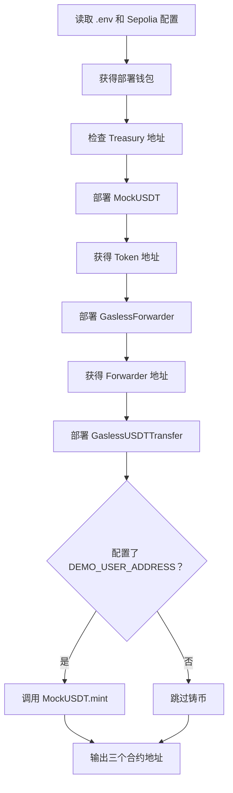

# Sepolia 合约部署顺序、参数与作用

运行：

```bash
npm run deploy:sepolia
```

会使用部署钱包在 Sepolia 上依次创建 3 个智能合约，并且可以选择给测试用户铸造 1,000 mUSDT。

部署合约本身也是链上交易，因此部署钱包必须拥有 Sepolia ETH。

## 命令实际执行了什么

`package.json` 中的命令是：

```bash
hardhat run scripts/deploy.ts \
  --build-profile production \
  --network sepolia
```

可以拆成三部分理解：

| 参数 | 作用 |
| --- | --- |
| `hardhat run scripts/deploy.ts` | 执行部署脚本 |
| `--build-profile production` | 使用生产编译配置 |
| `--network sepolia` | 把交易发送到 Sepolia，而不是本地网络 |

生产编译配置为：

```text
Solidity：0.8.28
Optimizer：开启
Optimizer runs：10,000
viaIR：开启
```

这些配置主要影响合约字节码大小和 Gas，不改变业务流程。

## 运行前需要哪些配置

Hardhat 从 `.env` 读取：

```dotenv
SEPOLIA_RPC_URL=https://ethereum-sepolia-rpc.publicnode.com
SEPOLIA_PRIVATE_KEY=部署钱包私钥

TREASURY_ADDRESS=服务费接收地址
DEMO_USER_ADDRESS=可选的测试用户地址
```

### `SEPOLIA_RPC_URL`

Sepolia RPC 节点地址。

作用是把部署交易广播到 Sepolia，并读取交易结果。

### `SEPOLIA_PRIVATE_KEY`

部署钱包的私钥。

这个钱包负责：

- 签署部署交易
- 支付三个合约的部署 Gas
- 成为 MockUSDT 的 Owner
- 如果配置测试用户，调用 `mint()` 铸造测试币

私钥不能提交到 Git，也不能发送给其他人。

### `TREASURY_ADDRESS`

接收 mUSDT 服务费的地址。

当前配置为：

```text
0x0Ad826C4d5c96EB5b27B6Dde45e1931C93F9A144
```

如果没有配置，脚本会自动使用部署钱包地址：

```typescript
const treasuryValue =
  process.env.TREASURY_ADDRESS ??
  deployer.account.address;
```

### `DEMO_USER_ADDRESS`

可选配置。

如果设置，部署完成后会给这个地址铸造：

```text
1,000 mUSDT
```

如果不设置，只部署合约，不铸造测试币。

## 整体部署顺序



准确顺序是：

1. 部署 `MockUSDT`
2. 部署 `GaslessForwarder`
3. 部署 `GaslessUSDTTransfer`
4. 可选调用 `MockUSDT.mint()`
5. 输出合约地址

## 准备部署客户端

脚本首先执行：

```typescript
const { viem, networkName } = await network.create();
const publicClient = await viem.getPublicClient();
const [deployer] = await viem.getWalletClients();
```

### `network.create()`

根据：

```bash
--network sepolia
```

创建 Sepolia 网络连接。

### `getPublicClient()`

创建只读客户端，主要用于：

- 查询区块链
- 查询交易状态
- 等待交易确认

它不会签名，也不持有私钥。

### `getWalletClients()`

根据 `SEPOLIA_PRIVATE_KEY` 创建钱包客户端。

```typescript
const [deployer] = await viem.getWalletClients();
```

`deployer` 就是部署钱包，它负责签名和支付 Gas。

## 检查 Treasury 地址

脚本先读取：

```typescript
const treasuryValue =
  process.env.TREASURY_ADDRESS ??
  deployer.account.address;
```

然后检查：

```typescript
if (!isAddress(treasuryValue)) {
  throw new Error("TREASURY_ADDRESS is not a valid address");
}
```

最后执行：

```typescript
const treasury = getAddress(treasuryValue);
```

### `isAddress()`

检查字符串是不是合法的以太坊地址。

例如下面是合法格式：

```text
0x0Ad826C4d5c96EB5b27B6Dde45e1931C93F9A144
```

### `getAddress()`

把地址转换成带大小写校验的 checksum 地址。

这一阶段没有访问智能合约，也没有发送交易。

## 第一步：部署 MockUSDT

脚本调用：

```typescript
const token = await viem.deployContract("MockUSDT", [
  deployer.account.address,
]);
```

传入一个构造函数参数：

```text
initialOwner = 部署钱包地址
```

对应合约构造函数：

```solidity
constructor(address initialOwner)
    ERC20("Mock USDT", "mUSDT")
    ERC20Permit("Mock USDT")
    Ownable(initialOwner)
{}
```

### 部署时做了什么

这一步会发送第一笔链上部署交易。

部署交易可以理解为：

```text
发送者：部署钱包
接收者：空，因为是在创建新合约
数据：MockUSDT 字节码 + initialOwner 参数
Gas：部署钱包支付
```

交易确认后，会产生一个新的 MockUSDT 合约地址。

### 构造函数参数

只有一个：

| 参数 | 传入值 | 作用 |
| --- | --- | --- |
| `initialOwner` | 部署钱包地址 | 设置 MockUSDT 的管理员 |

### `ERC20("Mock USDT", "mUSDT")`

设置代币信息：

```text
name   = Mock USDT
symbol = mUSDT
```

### `ERC20Permit("Mock USDT")`

启用 EIP-2612 Permit。

作用是允许用户通过签名授权代币额度，不需要用户自己发送 `approve()` 交易。

### `Ownable(initialOwner)`

把部署钱包设置为 Owner。

只有 Owner 可以调用：

```solidity
mint(address to, uint256 amount)
```

### `decimals()`

MockUSDT 重写为：

```solidity
function decimals() public pure override returns (uint8) {
    return 6;
}
```

因此：

```text
1 mUSDT = 1,000,000 个最小单位
```

这与 USDT 常见的 6 位小数保持一致。

### 部署后有没有代币？

没有。

部署 MockUSDT 只创建合约，不会自动铸造代币。

初始总供应量是：

```text
0 mUSDT
```

## 第二步：部署 GaslessForwarder

脚本调用：

```typescript
const forwarder =
  await viem.deployContract("GaslessForwarder");
```

这里没有显式传入参数。

对应构造函数：

```solidity
constructor()
    ERC2771Forwarder(FORWARDER_NAME)
{}
```

固定名称为：

```solidity
string public constant FORWARDER_NAME =
    "GaslessUSDTForwarder";
```

实际上传给 OpenZeppelin 父合约的参数是：

```text
GaslessUSDTForwarder
```

### 这一步的作用

发送第二笔链上部署交易，创建 ERC-2771 Forwarder。

Forwarder负责：

- 验证用户的 EIP-712 签名
- 管理用户 Forwarder Nonce
- 检查签名有效期
- 代表用户调用业务合约
- 把用户原始地址传递给业务合约

### 为什么需要固定名称

用户签署 ForwardRequest 时，EIP-712 Domain 中包含：

```text
name = GaslessUSDTForwarder
```

前端签名使用的名称必须和合约完全相同，否则：

```solidity
verify(request)
```

会返回 `false`。

### 为什么第二个部署 Forwarder

`GaslessUSDTTransfer` 构造函数需要 Forwarder 地址。

因此必须先部署 Forwarder，拿到地址后，才能部署业务合约。

MockUSDT 和 Forwarder 本身互不依赖，理论上可以交换部署顺序。但 `GaslessUSDTTransfer` 必须最后部署。

## 第三步：部署 GaslessUSDTTransfer

脚本调用：

```typescript
const recipient = await viem.deployContract(
  "GaslessUSDTTransfer",
  [
    token.address,
    forwarder.address,
    treasury,
  ],
);
```

这一步传入三个参数：

| 顺序 | 参数 | 实际值 |
| ---: | --- | --- |
| 1 | `token_` | 新部署的 MockUSDT 地址 |
| 2 | `trustedForwarder_` | 新部署的 Forwarder 地址 |
| 3 | `treasury_` | `.env` 中的 Treasury 地址 |

对应构造函数：

```solidity
constructor(
    address token_,
    address trustedForwarder_,
    address treasury_
) ERC2771Context(trustedForwarder_) {
    if (
        token_ == address(0) ||
        trustedForwarder_ == address(0) ||
        treasury_ == address(0)
    ) {
        revert ZeroAddress();
    }

    token = IERC20(token_);
    permitToken = IERC20Permit(token_);
    treasury = treasury_;
}
```

### 参数一：`token_`

传入：

```text
token.address
```

也就是第一步部署的 MockUSDT 地址。

作用：

- 指定业务合约只能处理这个 mUSDT
- 后续调用 `permit()`
- 后续调用 `allowance()`
- 后续调用 `transferFrom()`

部署后保存为：

```solidity
IERC20 public immutable token;
IERC20Permit public immutable permitToken;
```

`immutable` 表示部署完成后不能修改。

### 参数二：`trustedForwarder_`

传入：

```text
forwarder.address
```

也就是第二步部署的 GaslessForwarder 地址。

它被传给：

```solidity
ERC2771Context(trustedForwarder_)
```

作用：

- 告诉业务合约哪个 Forwarder 是可信的
- 只有这个 Forwarder 才能附带原始用户地址
- `_msgSender()` 才能正确识别用户

如果传错地址，Gasless 转账无法正确识别用户。

这个地址部署后同样不能修改。

### 参数三：`treasury_`

传入：

```text
TREASURY_ADDRESS
```

作用：

- 接收 Relayer 服务费
- 用户转账时，服务费会发送到这个地址

例如：

```text
用户发送：2 mUSDT
服务费：0.1 mUSDT
```

业务合约最终执行：

```text
用户 → 接收人：2 mUSDT
用户 → Treasury：0.1 mUSDT
```

Treasury 地址部署后不能修改。

### 零地址检查

构造函数检查三个参数：

```solidity
if (
    token_ == address(0) ||
    trustedForwarder_ == address(0) ||
    treasury_ == address(0)
) {
    revert ZeroAddress();
}
```

只要有一个参数是：

```text
0x0000000000000000000000000000000000000000
```

第三笔部署交易就会失败。

### 为什么必须最后部署

GaslessUSDTTransfer 依赖：

```text
MockUSDT 地址
Forwarder 地址
Treasury 地址
```

前两个地址只有对应合约部署后才能确定。

所以顺序必须是：

```text
先部署 Token
先部署 Forwarder
最后部署 GaslessUSDTTransfer
```

## 变量名 `recipient` 容易误解

脚本中写的是：

```typescript
const recipient =
  await viem.deployContract("GaslessUSDTTransfer", ...);
```

输出变量是：

```text
RECIPIENT_ADDRESS
```

这里的 `recipient` 不是最终收到 mUSDT 的用户。

它表示 ERC-2771 的“接收调用合约”，也就是：

```text
GaslessUSDTTransfer 业务合约
```

真正的 mUSDT 接收地址，是用户每次转账时填写的：

```solidity
transferWithPermit(address recipient, ...)
```

因此两者不要混淆：

```text
RECIPIENT_ADDRESS
  = GaslessUSDTTransfer 合约地址

transferWithPermit 的 recipient
  = 最终收到 mUSDT 的钱包地址
```

## 可选步骤：给测试用户铸造 mUSDT

三个合约部署完成后，脚本读取：

```typescript
const demoUserValue =
  process.env.DEMO_USER_ADDRESS;
```

如果没有配置，直接跳过。

如果配置了，先检查：

```typescript
if (!isAddress(demoUserValue)) {
  throw new Error(
    "DEMO_USER_ADDRESS is not a valid address"
  );
}
```

然后调用 MockUSDT：

```typescript
const hash = await token.write.mint([
  getAddress(demoUserValue),
  parseUnits("1000", 6),
]);
```

对应合约函数：

```solidity
function mint(
    address to,
    uint256 amount
) external onlyOwner {
    _mint(to, amount);
}
```

### `to`

传入：

```text
DEMO_USER_ADDRESS
```

它是接收测试币的用户钱包。

### `amount`

代码使用：

```typescript
parseUnits("1000", 6)
```

转换过程：

```text
1000 × 10⁶
= 1,000,000,000
```

因此调用的实际参数是：

```text
amount = 1,000,000,000
```

链上显示为：

```text
1,000 mUSDT
```

### `onlyOwner`

只有 MockUSDT Owner 可以调用 `mint()`。

因为部署时已经设置：

```text
Owner = deployer.account.address
```

而当前调用也是由部署钱包发送，所以权限检查能够通过。

如果换成其他钱包调用，会回滚。

### 等待确认

发送 `mint()` 后，脚本执行：

```typescript
await publicClient.waitForTransactionReceipt({
  hash,
  confirmations: 1,
});
```

作用：

- 等待铸币交易进入区块
- 等待至少 1 个区块确认
- 确保测试币已经到账后再继续

## 总共有几笔链上交易

### 没有配置 `DEMO_USER_ADDRESS`

一共 3 笔：

| 顺序 | 交易 | Gas 支付者 |
| ---: | --- | --- |
| 1 | 部署 MockUSDT | 部署钱包 |
| 2 | 部署 GaslessForwarder | 部署钱包 |
| 3 | 部署 GaslessUSDTTransfer | 部署钱包 |

### 配置了 `DEMO_USER_ADDRESS`

一共 4 笔：

| 顺序 | 交易 | Gas 支付者 |
| ---: | --- | --- |
| 1 | 部署 MockUSDT | 部署钱包 |
| 2 | 部署 GaslessForwarder | 部署钱包 |
| 3 | 部署 GaslessUSDTTransfer | 部署钱包 |
| 4 | 调用 MockUSDT.`mint()` | 部署钱包 |

这里还没有使用 Relayer。

部署阶段的 Gas 全部由 `SEPOLIA_PRIVATE_KEY` 对应的钱包支付。

## 部署完成后的输出

脚本最后输出：

```typescript
console.log(`TOKEN_ADDRESS=${token.address}`);
console.log(
  `FORWARDER_ADDRESS=${forwarder.address}`
);
console.log(
  `RECIPIENT_ADDRESS=${recipient.address}`
);
```

示例：

```dotenv
TOKEN_ADDRESS=0x91C6cA0c8925d0E62C5eA932ED63338eaAfa5Ea3
FORWARDER_ADDRESS=0x46F094C285Db58F6CC61D9eE621528A363DD5F2B
RECIPIENT_ADDRESS=0x580b3212f6Ef9763A48b708113Ca768BAed00163
```

三个变量分别表示：

| 变量 | 对应合约 |
| --- | --- |
| `TOKEN_ADDRESS` | MockUSDT |
| `FORWARDER_ADDRESS` | GaslessForwarder |
| `RECIPIENT_ADDRESS` | GaslessUSDTTransfer |

脚本只会打印地址，不会自动写入 `.env`。

部署后需要手动把新地址复制到 `.env`，然后重新启动 Relayer 和前端。

## 部署参数总结

### MockUSDT

```text
构造函数参数数量：1
```

```solidity
constructor(address initialOwner)
```

| 参数 | 值 | 作用 |
| --- | --- | --- |
| `initialOwner` | 部署钱包 | 获得 `mint()` 权限 |

### GaslessForwarder

```text
构造函数显式参数数量：0
```

内部固定传入父合约：

```text
GaslessUSDTForwarder
```

| 参数 | 值 | 作用 |
| --- | --- | --- |
| EIP-712 Name | `GaslessUSDTForwarder` | 验证 ForwardRequest 签名 |

### GaslessUSDTTransfer

```text
构造函数参数数量：3
```

```solidity
constructor(
    address token_,
    address trustedForwarder_,
    address treasury_
)
```

| 参数 | 值 | 作用 |
| --- | --- | --- |
| `token_` | MockUSDT 地址 | 指定使用哪个代币 |
| `trustedForwarder_` | Forwarder 地址 | 指定可信转发合约 |
| `treasury_` | Treasury 地址 | 接收 mUSDT 服务费 |

## 哪些参数不会在部署时传入

下面这些参数不属于构造函数参数：

```text
RELAYER_FEE_USDT
REQUEST_GAS
MAX_RELAY_GAS
MAX_TRANSFER_USDT
RELAYER_PRIVATE_KEY
```

它们属于 Relayer 的运行配置。

例如：

```text
RELAYER_FEE_USDT=100000
```

表示服务费为：

```text
0.1 mUSDT
```

GaslessUSDTTransfer 合约没有固定写死 `0.1 mUSDT`，它只规定：

```solidity
MAX_FEE_BPS = 500;
```

也就是：

```text
服务费不能超过转账金额的 5%
```

具体收多少，由 Relayer 报价和策略决定。

## 重新运行部署命令会怎样

再次执行：

```bash
npm run deploy:sepolia
```

不会连接或更新旧合约，而是重新部署一套新的合约。

结果是：

- 新的 MockUSDT 地址
- 新的 Forwarder 地址
- 新的 GaslessUSDTTransfer 地址
- 再次支付部署 Gas
- 旧合约继续存在
- 旧合约中的余额不会自动迁移

因此每次重新部署后，都要更新：

```dotenv
TOKEN_ADDRESS=新地址
FORWARDER_ADDRESS=新地址
RECIPIENT_ADDRESS=新地址
```

然后重新启动：

```bash
npm run relayer
npm run web
```

## 需要特别注意的脚本细节

当前脚本是在三个合约部署完成后，才验证：

```text
DEMO_USER_ADDRESS
```

所以如果 `DEMO_USER_ADDRESS` 格式错误，可能发生：

```text
三个合约已经成功部署
↓
检查 DEMO_USER_ADDRESS 失败
↓
脚本最终显示报错
```

这时不能认为“什么都没部署”。

区块链交易不能因为脚本后面报错而撤销。部署交易一旦确认，合约就已经存在。

同样，如果 `mint()` 失败：

- 三个合约仍然已经部署
- 只有铸币交易失败
- 已经花费的部署 Gas 不会退回

## 最简理解

可以把三个合约理解成：

```text
MockUSDT
  = 银行里的测试代币账本

GaslessForwarder
  = 检查用户委托书的可信代理

GaslessUSDTTransfer
  = 根据委托书执行转账和收取服务费的业务柜台
```

部署顺序是：

```text
先创建代币账本
↓
再创建可信代理
↓
最后创建同时连接账本和代理的业务柜台
```

## 相关源码

- [`scripts/deploy.ts`](../scripts/deploy.ts)
- [`contracts/mocks/MockUSDT.sol`](../contracts/mocks/MockUSDT.sol)
- [`contracts/GaslessForwarder.sol`](../contracts/GaslessForwarder.sol)
- [`contracts/GaslessUSDTTransfer.sol`](../contracts/GaslessUSDTTransfer.sol)

